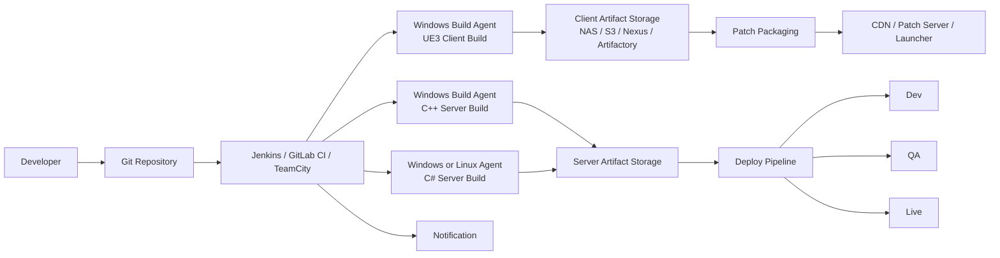
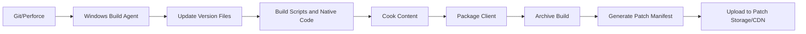
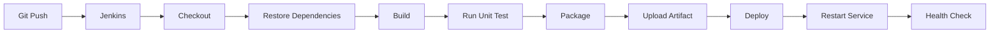
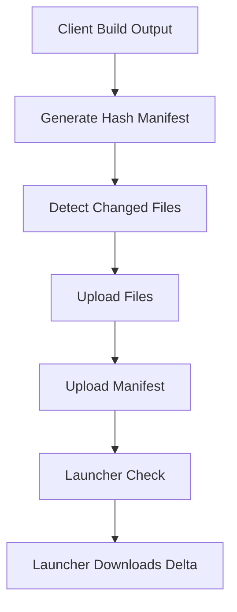

# 1. 개요
이 경우 핵심은 **게임 클라이언트와 게임 서버를 같은 CI/CD 체계 안에서 관리하되, 빌드 방식과 배포 방식은 애플리케이션 성격에 맞게 분리하는 것**이다.

Unreal Engine 3 기반 클라이언트는 일반적인 웹 애플리케이션처럼 단순 빌드가 아니라, 보통 다음 요소가 함께 들어간다.

- 게임 코드 빌드
- 스크립트/패키지 빌드
- 리소스 Cook/Package
- 패치 파일 생성
- 런처 또는 패치 서버 업로드

반면 게임 서버는 C++이면 `MSBuild` 또는 `CMake`, C#이면 `dotnet build/publish` 방식으로 비교적 표준화된 CI/CD 구성이 가능하다.

즉 구조적으로는 하나의 시스템처럼 보여도, 실제로는 아래 4개 파이프라인으로 나누어 설계하는 것이 가장 현실적이다.

- UE3 클라이언트 빌드/배포
- C++ 서버 빌드/배포
- C# 서버 빌드/배포
- 공통 아티팩트 관리 및 환경별 배포

---

# 2. 전체 아키텍처



이 구조의 핵심은 다음과 같다.

- 클라이언트 빌드는 전용 Windows 에이전트에서 수행
- 서버 빌드는 언어별 에이전트에서 수행
- 결과물은 중앙 아티팩트 저장소에 적재
- 배포는 빌드와 분리하여 수행
- 운영 배포는 승인 단계를 추가

---

# 3. 저장소 전략

게임 프로젝트는 대개 다음 3가지 저장소 전략 중 하나를 사용한다.

## 3-1. 클라이언트/서버 저장소 분리

예:

- `game-client-ue3`
- `game-server-cpp`
- `game-server-csharp`

장점은 파이프라인이 단순하다는 점이다.  
단점은 릴리스 버전 동기화가 다소 번거롭다는 점이다.

## 3-2. Monorepo

예:

- `/client`
- `/server/cpp`
- `/server/csharp`

장점은 버전 통합 관리가 쉽다는 점이다.  
단점은 변경 감지와 조건부 빌드 로직을 잘 설계해야 한다는 점이다.

## 3-3. 하이브리드

실무적으로 가장 많이 쓰는 방식이다.

- 클라이언트는 별도 저장소
- 서버는 monorepo 또는 기능별 저장소

그 이유는 클라이언트 쪽은 대용량 바이너리, 리소스, 전용 빌드 환경 때문에 독립성이 필요하고, 서버는 코드 중심이라 통합 관리가 편하기 때문이다.

---

# 4. 브랜치 및 배포 전략

가장 무난한 전략은 아래와 같다.

- `develop` → Dev 자동 배포
- `release/*` → QA/Staging 배포
- `main` 또는 `live` → 운영 배포
- `tag v1.2.3` → 릴리스 패키지 생성

예를 들면 다음과 같다.

- UE3 클라이언트
    - `develop` 빌드 → 내부 테스트 패치 서버 업로드
    - `release/1.2.0` → QA 패치 업로드
    - `v1.2.0` 태그 → 라이브 CDN 업로드
- 서버
    - `develop` → Dev 서버 자동 배포
    - `release/*` → QA 배포
    - `main` → 운영 승인 후 배포

이렇게 분리해두면 빌드 번호와 릴리스 버전이 섞이지 않고, 운영 릴리스 흐름도 명확해진다.

---

# 5. 빌드 환경 설계

# 5-1. UE3 클라이언트 빌드 환경

UE3는 프로젝트마다 툴체인 편차가 크기 때문에, 먼저 빌드 환경을 고정해야 한다.

주요 구성은 보통 다음과 같다.

- Windows Server 또는 Windows 10/11
- Visual Studio 특정 버전
- DirectX SDK
- .NET Framework
- Unreal Frontend 또는 내부 빌드 배치
- 게임 전용 스크립트 빌드 도구
- Cook/Package 툴

권장 구성은 다음과 같다.

- UE3 전용 Windows 빌드 머신 분리
- SSD 로컬 디스크에 Intermediate/Cook 산출물 저장
- 최종 결과물만 중앙 스토리지 업로드
- 빌드 머신 이미지와 설치 버전 고정

UE3는 환경 차이로 결과물이 달라질 수 있으므로, 일반 공용 빌드 노드에 섞어 쓰는 것은 피하는 편이 좋다.

---

# 5-2. C++ 서버 빌드 환경

C++ 서버는 보통 아래 두 가지 유형이다.

- Visual Studio Solution 기반
- CMake 기반

Windows 서비스라면:

- Visual Studio Build Tools
- MSBuild
- CMake
- vcpkg 또는 별도 라이브러리 관리

Linux 바이너리라면:

- GCC/Clang
- CMake/Make/Ninja
- Docker 빌드 환경

가능하면 서버는 **빌드 환경을 코드로 재현할 수 있게** 만드는 것이 중요하다.

---

# 5-3. C# 서버 빌드 환경

C# 서버는 상대적으로 단순하다.

- .NET Framework 계열이면 Windows 에이전트
- .NET 6/7/8 이상이면 Linux/Windows 모두 가능
- `dotnet restore`
- `dotnet build`
- `dotnet test`
- `dotnet publish`

배포는 publish 산출물을 zip 또는 tar로 패키징하여 진행하면 된다.

---

# 6. 버전 관리 규칙

권장하는 버전 구조는 다음과 같다.

- 릴리스 버전: `1.2.0`
- 빌드 번호 포함 버전: `1.2.0+152`
- 아티팩트 파일명 예시
    - `GameClient-1.2.0+152-win64.zip`
    - `GameServerCpp-1.2.0+152.zip`
    - `GameServerCs-1.2.0+152.zip`

추가로 반드시 남겨야 하는 정보는 다음과 같다.

- Git commit hash
- branch name
- build number
- build time
- build agent 정보

예시:

```json
{
  "version": "1.2.0",
  "buildNumber": "152",
  "commit": "a1b2c3d4",
  "branch": "release/1.2.0",
  "builtAt": "2026-04-20T15:10:00+09:00"
}
```

이 정보는 추후 장애 분석, 핫픽스, 롤백 시 매우 중요하다.

---

# 7. UE3 클라이언트 CI/CD 설계

UE3 클라이언트는 보통 아래 순서로 빌드된다.

1. 소스 체크아웃
2. 버전 파일 갱신
3. 스크립트 또는 네이티브 코드 빌드
4. Cook
5. Package
6. 결과물 정리
7. 패치 매니페스트 생성
8. 패치 서버 또는 CDN 업로드

## 7-1. UE3 클라이언트 빌드 개념도



---

## 7-2. UE3 클라이언트 PowerShell 빌드 스크립트 예시

`build-client.ps1`

```powershell
param(
    [string]$ProjectRoot = "D:\Jenkins\workspace\game-client",
    [string]$OutputRoot = "D:\BuildOutput\Client",
    [string]$Configuration = "Release",
    [string]$BuildVersion = "1.2.0",
    [string]$BuildNumber = "152"
)

$ErrorActionPreference = "Stop"

$timestamp = Get-Date -Format "yyyyMMdd_HHmmss"
$artifactName = "GameClient-$BuildVersion+$BuildNumber-$timestamp"
$artifactDir = Join-Path $OutputRoot $artifactName

Write-Host "== Prepare directories =="
New-Item -ItemType Directory -Force -Path $artifactDir | Out-Null

Write-Host "== Update version file =="
$versionFile = Join-Path $ProjectRoot "Game\Config\BuildVersion.ini"
@"
[BuildInfo]
Version=$BuildVersion
BuildNumber=$BuildNumber
BuildTime=$timestamp
"@ | Set-Content -Path $versionFile -Encoding ASCII

Write-Host "== Build game scripts / native code =="
& "C:\BuildTools\BuildGame.bat" `
    "$ProjectRoot" `
    "$Configuration"

if ($LASTEXITCODE -ne 0) {
    throw "Game build failed"
}

Write-Host "== Cook assets =="
& "C:\BuildTools\CookContent.bat" `
    "$ProjectRoot" `
    "$Configuration"

if ($LASTEXITCODE -ne 0) {
    throw "Cook failed"
}

Write-Host "== Package client =="
& "C:\BuildTools\PackageClient.bat" `
    "$ProjectRoot" `
    "$artifactDir"

if ($LASTEXITCODE -ne 0) {
    throw "Package failed"
}

Write-Host "== Generate build metadata =="
$metadata = @{
    version = $BuildVersion
    buildNumber = $BuildNumber
    builtAt = (Get-Date).ToString("o")
    configuration = $Configuration
} | ConvertTo-Json -Depth 3

$metadata | Set-Content -Path (Join-Path $artifactDir "build-info.json") -Encoding UTF8

Write-Host "== Compress artifact =="
$zipPath = "$artifactDir.zip"
if (Test-Path $zipPath) { Remove-Item $zipPath -Force }
Compress-Archive -Path "$artifactDir\*" -DestinationPath $zipPath

Write-Host "Client artifact created: $zipPath"
```

이 스크립트의 포인트는 다음과 같다.

- 버전 파일을 먼저 갱신
- 내부 UE3 빌드 툴을 래핑
- 실패 시 즉시 종료
- 최종 산출물을 zip으로 묶음
- 메타데이터를 함께 저장

---

## 7-3. 패치 매니페스트 생성 예시

런처가 변경 파일만 다운로드하게 하려면 파일 해시 기반 매니페스트가 필요하다.

`generate-manifest.ps1`

```powershell
param(
    [string]$BuildDir
)

$files = Get-ChildItem -Path $BuildDir -Recurse -File
$result = @()

foreach ($file in $files) {
    $hash = Get-FileHash $file.FullName -Algorithm SHA256
    $relativePath = $file.FullName.Substring($BuildDir.Length).TrimStart('\')
    $result += [PSCustomObject]@{
        path = $relativePath.Replace("\", "/")
        size = $file.Length
        sha256 = $hash.Hash.ToLower()
    }
}

$result | ConvertTo-Json -Depth 5 | Set-Content -Path (Join-Path $BuildDir "manifest.json") -Encoding UTF8
```

런처는 보통 다음 순서로 동작한다.

1. 서버의 `manifest.json` 다운로드
2. 로컬 설치 파일의 hash 계산
3. 차이가 나는 파일 목록 도출
4. 변경 파일만 다운로드
5. 완료 후 로컬 버전 갱신

즉 이 구조는 “클라이언트 재설치”가 아니라 “패치 배포”를 위한 구조이다.

---

# 8. C++ 서버 CI/CD 설계

C++ 서버는 빌드 도구 표준화가 가장 중요하다.  
프로젝트에 따라 `sln + msbuild` 또는 `cmake` 기반이 된다.

## 8-1. C++ 서버 개념도



---

## 8-2. Visual Studio Solution 기반 빌드 예시

`build-server-cpp.bat`

```bat
@echo off
setlocal enabledelayedexpansion

set WORKSPACE=%~1
set CONFIGURATION=%~2
set PLATFORM=x64
set SOLUTION=%WORKSPACE%\GameServer.sln
set OUTPUT_DIR=%WORKSPACE%\dist

if "%CONFIGURATION%"=="" set CONFIGURATION=Release

echo [1] Clean output
if exist "%OUTPUT_DIR%" rmdir /s /q "%OUTPUT_DIR%"
mkdir "%OUTPUT_DIR%"

echo [2] Build solution
call "C:\Program Files\Microsoft Visual Studio\2022\BuildTools\Common7\Tools\VsDevCmd.bat"
msbuild "%SOLUTION%" /t:Rebuild /p:Configuration=%CONFIGURATION%;Platform=%PLATFORM% /m
if errorlevel 1 exit /b 1

echo [3] Copy binaries
xcopy /E /Y "%WORKSPACE%\Bin\%CONFIGURATION%\*" "%OUTPUT_DIR%\"

echo [4] Package
powershell -Command "Compress-Archive -Path '%OUTPUT_DIR%\*' -DestinationPath '%WORKSPACE%\GameServerCpp.zip' -Force"

echo Build complete
exit /b 0
```

이 방식은 오래된 게임 서버 코드베이스에서도 가장 흔하게 사용된다.

---

## 8-3. CMake 기반 빌드 예시

`build-server-cpp.ps1`

```powershell
param(
    [string]$SourceDir = "D:\Jenkins\workspace\game-server-cpp",
    [string]$BuildDir = "D:\Jenkins\workspace\game-server-cpp\build",
    [string]$InstallDir = "D:\Jenkins\workspace\game-server-cpp\dist"
)

$ErrorActionPreference = "Stop"

if (Test-Path $BuildDir) { Remove-Item $BuildDir -Recurse -Force }
if (Test-Path $InstallDir) { Remove-Item $InstallDir -Recurse -Force }

New-Item -ItemType Directory -Path $BuildDir | Out-Null
New-Item -ItemType Directory -Path $InstallDir | Out-Null

cmake -S $SourceDir -B $BuildDir -G "Visual Studio 17 2022" -A x64 `
  -DCMAKE_BUILD_TYPE=Release `
  -DCMAKE_INSTALL_PREFIX=$InstallDir

if ($LASTEXITCODE -ne 0) { throw "CMake configure failed" }

cmake --build $BuildDir --config Release --parallel
if ($LASTEXITCODE -ne 0) { throw "Build failed" }

cmake --install $BuildDir --config Release
if ($LASTEXITCODE -ne 0) { throw "Install failed" }

Compress-Archive -Path "$InstallDir\*" -DestinationPath "$SourceDir\GameServerCpp.zip" -Force
```

이 구조의 장점은 빌드와 패키징을 표준화하기 쉽다는 점이다.

---

# 9. C# 서버 CI/CD 설계

C# 서버는 상대적으로 구현이 단순하며, publish 결과물을 그대로 배포하는 구조가 일반적이다.

## 9-1. C# 서버 빌드 스크립트 예시

`build-server-cs.ps1`

```powershell
param(
    [string]$ProjectPath = "D:\Jenkins\workspace\game-server-cs\GameServer.Api\GameServer.Api.csproj",
    [string]$Configuration = "Release",
    [string]$OutputDir = "D:\Jenkins\workspace\game-server-cs\publish"
)

$ErrorActionPreference = "Stop"

if (Test-Path $OutputDir) {
    Remove-Item $OutputDir -Recurse -Force
}

dotnet restore $ProjectPath
if ($LASTEXITCODE -ne 0) { throw "Restore failed" }

dotnet build $ProjectPath -c $Configuration --no-restore
if ($LASTEXITCODE -ne 0) { throw "Build failed" }

dotnet test "D:\Jenkins\workspace\game-server-cs\Tests\Tests.csproj" -c $Configuration --no-build
if ($LASTEXITCODE -ne 0) { throw "Tests failed" }

dotnet publish $ProjectPath -c $Configuration -o $OutputDir --no-build
if ($LASTEXITCODE -ne 0) { throw "Publish failed" }

Compress-Archive -Path "$OutputDir\*" -DestinationPath "D:\Jenkins\workspace\game-server-cs\GameServerCs.zip" -Force
```

이 방식은 다음과 같은 장점이 있다.

- 종속성 복구, 빌드, 테스트, publish 단계가 명확하다
- 운영 서버에는 SDK 없이 runtime만 있으면 되는 경우가 많다
- 환경별 설정 파일 분리가 쉽다

---

# 10. Jenkins Pipeline 예시

하나의 Jenkinsfile에서 애플리케이션 유형별로 분기하는 방식의 예시이다.

```groovy
pipeline {
    agent none

    parameters {
        choice(name: 'APP_TYPE', choices: ['UE3_CLIENT', 'CPP_SERVER', 'CS_SERVER'], description: 'Application type')
        choice(name: 'TARGET_ENV', choices: ['dev', 'qa', 'live'], description: 'Deploy target')
        string(name: 'VERSION', defaultValue: '1.0.0', description: 'Release version')
    }

    environment {
        BUILD_NUMBER_STR = "${env.BUILD_NUMBER}"
    }

    stages {
        stage('Checkout') {
            agent { label 'windows-common' }
            steps {
                checkout scm
            }
        }

        stage('Build UE3 Client') {
            when {
                expression { params.APP_TYPE == 'UE3_CLIENT' }
            }
            agent { label 'windows-ue3' }
            steps {
                powershell """
                .\\ci\\client\\build-client.ps1 `
                  -ProjectRoot "${WORKSPACE}" `
                  -OutputRoot "D:\\BuildOutput\\Client" `
                  -BuildVersion "${params.VERSION}" `
                  -BuildNumber "${BUILD_NUMBER_STR}"
                """
            }
        }

        stage('Build C++ Server') {
            when {
                expression { params.APP_TYPE == 'CPP_SERVER' }
            }
            agent { label 'windows-cpp' }
            steps {
                bat """
                call .\\ci\\server-cpp\\build-server-cpp.bat "${WORKSPACE}" "Release"
                """
            }
        }

        stage('Build C# Server') {
            when {
                expression { params.APP_TYPE == 'CS_SERVER' }
            }
            agent { label 'windows-dotnet' }
            steps {
                powershell """
                .\\ci\\server-cs\\build-server-cs.ps1 `
                  -ProjectPath "${WORKSPACE}\\GameServer.Api\\GameServer.Api.csproj" `
                  -Configuration "Release" `
                  -OutputDir "${WORKSPACE}\\publish"
                """
            }
        }

        stage('Archive') {
            agent { label 'windows-common' }
            steps {
                archiveArtifacts artifacts: '**/*.zip', fingerprint: true
            }
        }

        stage('Deploy') {
            when {
                expression { params.TARGET_ENV in ['dev', 'qa', 'live'] }
            }
            agent { label 'deploy-node' }
            steps {
                powershell """
                .\\ci\\deploy\\deploy.ps1 `
                  -AppType "${params.APP_TYPE}" `
                  -TargetEnv "${params.TARGET_ENV}" `
                  -Version "${params.VERSION}" `
                  -BuildNumber "${BUILD_NUMBER_STR}"
                """
            }
        }
    }

    post {
        success {
            echo "Build and deployment completed successfully."
        }
        failure {
            echo "Pipeline failed."
        }
        always {
            cleanWs()
        }
    }
}
```

이 파이프라인은 구조를 설명하기 위한 예시이며, 실제로는 아래처럼 나누는 것이 더 좋다.

- Client Build Job
- Cpp Server Build Job
- CSharp Server Build Job
- Deploy Job
- Rollback Job

즉 “하나의 Jenkinsfile”도 가능하지만, 운영에서는 역할 분리형 Job 구성이 더 관리하기 좋다.

---

# 11. 서버 배포 전략

게임 서버는 웹 서버처럼 무조건 rolling update만 적용하면 안 된다.  
특히 세션, 매치, 방 단위 상태를 갖는 서버는 배포 전 drain 절차가 필요하다.

## 11-1. 권장 배포 방식

### 1) 직접 배포 + 서비스 재시작

가장 단순한 방식이다.

- 압축 파일 복사
- 서비스 중지
- 새 버전 압축 해제
- 서비스 시작
- 헬스체크

### 2) 블루/그린 배포

로그인 서버나 게이트웨이 계층에 적합하다.

- 새 버전 인스턴스 기동
- 헬스체크 통과
- 트래픽 전환
- 문제 시 즉시 롤백

### 3) 세션 drain 배포

매치 서버나 채널 서버에 적합하다.

- 신규 세션 유입 차단
- 기존 세션 종료 대기
- 서버 교체
- 재등록

게임 서버는 이 세션 drain 개념이 매우 중요하다.

---

## 11-2. Windows 서버 배포 스크립트 예시

`deploy.ps1`

```powershell
param(
    [string]$AppType,
    [string]$TargetEnv,
    [string]$Version,
    [string]$BuildNumber
)

$ErrorActionPreference = "Stop"

$artifactMap = @{
    "CPP_SERVER" = "GameServerCpp.zip"
    "CS_SERVER"  = "GameServerCs.zip"
}

if (-not $artifactMap.ContainsKey($AppType)) {
    Write-Host "Client deploy is handled separately."
    exit 0
}

$artifactName = $artifactMap[$AppType]
$artifactPath = Join-Path $PSScriptRoot "..\..\$artifactName"

$targets = switch ($TargetEnv) {
    "dev"  { @("dev-game-01") }
    "qa"   { @("qa-game-01", "qa-game-02") }
    "live" { @("live-game-01", "live-game-02") }
}

$remoteBase = "D:\Games\Services\Current"
$serviceName = if ($AppType -eq "CPP_SERVER") { "GameServerCpp" } else { "GameServerCs" }

foreach ($target in $targets) {
    Write-Host "Deploying to $target"

    $session = New-PSSession -ComputerName $target

    Copy-Item $artifactPath -Destination "C:\Temp\$artifactName" -ToSession $session -Force

    Invoke-Command -Session $session -ScriptBlock {
        param($artifactName, $remoteBase, $serviceName)

        Stop-Service $serviceName -Force

        $releaseDir = Join-Path $remoteBase ("release_" + (Get-Date -Format "yyyyMMdd_HHmmss"))
        New-Item -ItemType Directory -Force -Path $releaseDir | Out-Null

        Expand-Archive -Path "C:\Temp\$artifactName" -DestinationPath $releaseDir -Force

        $currentLink = Join-Path $remoteBase "active"
        if (Test-Path $currentLink) {
            Remove-Item $currentLink -Force
        }

        New-Item -ItemType SymbolicLink -Path $currentLink -Target $releaseDir | Out-Null

        Start-Service $serviceName
    } -ArgumentList $artifactName, $remoteBase, $serviceName

    Remove-PSSession $session
}
```

이 스크립트는 매우 단순화된 예시지만, 중요한 운영 개념 두 가지를 담고 있다.

- `release_YYYYMMDD_HHMMSS` 디렉토리 단위 배포
- `active` 심볼릭 링크 전환

즉 롤백할 때는 이전 release 디렉토리로 링크만 되돌리면 된다.

---

# 12. 클라이언트 배포 구조

클라이언트는 서버처럼 “서비스 재시작” 개념이 아니라, 보통 패치 서버 업로드 구조이다.

## 12-1. 클라이언트 배포 개념도



즉 클라이언트 배포는 다음과 같은 흐름이다.

- 빌드 결과물 생성
- 파일 해시 계산
- 변경 파일만 분리
- 패치 스토리지 업로드
- 최신 manifest 배포
- 런처가 차이 파일 다운로드

---

## 12-2. S3 업로드 예시

`upload-client.ps1`

```powershell
param(
    [string]$BuildDir,
    [string]$BucketName = "game-client-patch",
    [string]$Version = "1.2.0"
)

$ErrorActionPreference = "Stop"

aws s3 cp "$BuildDir" "s3://$BucketName/releases/$Version/" --recursive
if ($LASTEXITCODE -ne 0) {
    throw "Upload failed"
}

Write-Host "Uploaded client build to s3://$BucketName/releases/$Version/"
```

운영에서는 여기에 보통 다음이 더 붙는다.

- `latest.json` 갱신
- 버전별 manifest 저장
- 패치 무결성 검증
- CDN 캐시 갱신

---

# 13. 아티팩트 저장소 설계

Jenkins workspace에만 의존하면 안 된다.  
빌드 결과물은 반드시 외부 저장소에 보관해야 한다.

권장 저장소는 다음과 같다.

- S3
- Nexus Repository
- JFrog Artifactory
- NAS

## 저장 대상

- 클라이언트 zip
- 클라이언트 manifest
- 서버 zip
- 빌드 메타데이터
- 심볼/debug 파일
- 릴리스 노트

## 이유

- 장애 시 이전 버전 재배포 가능
- 빌드 재현성 확보
- 운영/QA/개발 환경 간 버전 추적 가능
- 특정 커밋 산출물 검증 가능

---

# 14. 장애 대응과 롤백

게임 배포에서는 이 부분이 매우 중요하다.

## 14-1. 서버 롤백 전략

서버는 아래 구조가 가장 단순하면서 실용적이다.

- 배포 시 release 디렉토리 새로 생성
- `active` 링크 전환
- 문제 발생 시 이전 release로 링크 복구
- 서비스 재시작

## 14-2. 클라이언트 롤백 전략

클라이언트는 다음 기준으로 처리한다.

- 이전 버전 manifest 유지
- 런처가 특정 버전을 바라보도록 설정 가능
- CDN에 최소 1~2개 이전 버전 보관

즉 서버는 “실행 파일 전환”, 클라이언트는 “패치 기준 전환”이다.

---

# 15. 운영 안정성을 위한 추가 구성

다음 요소는 반드시 넣는 것이 좋다.

## 15-1. 헬스체크

단순 프로세스 기동 확인만으로는 부족하다.

서버는 최소한 아래를 체크해야 한다.

- TCP 포트 오픈 여부
- 로그인 가능 여부
- DB 연결 여부
- 캐시/메시지 브로커 연결 여부
- 버전 응답 API

예를 들어 로그인 서버라면 “프로세스가 떴다”가 아니라 “로그인 패킷 처리 가능”까지 봐야 의미가 있다.

## 15-2. 알림

빌드/배포 성공 여부는 반드시 팀 채널로 전송해야 한다.

예:

- Slack
- Teams
- 이메일

포함할 정보:

- 빌드 번호
- 버전
- 브랜치
- 커밋
- 수행자
- 배포 대상 환경
- 성공/실패 여부

## 15-3. 승인 단계

운영 배포는 자동 즉시 배포보다 승인 단계를 두는 것이 좋다.

예:

- Dev → 자동
- QA → 자동 또는 반자동
- Live → 승인 후 배포

---

# 16. 실무에서 자주 발생하는 문제

## 16-1. UE3 클라이언트 쪽

- 빌드 머신별 결과 차이
- 오래된 SDK/Toolchain 충돌
- Cook 시간 과다
- 패치 파일 크기 증가
- 에셋 관리 문제

### 대응

- 빌드 머신 이미지 고정
- 툴체인 버전 고정
- 전용 에이전트 분리
- 패치 단위 최소화
- 리소스와 코드 변경 흐름 분리

---

## 16-2. C++ 서버 쪽

- DLL 누락
- 런타임 재배포 누락
- Debug/Release 혼선
- 외부 라이브러리 버전 불일치

### 대응

- install/package 단계 분리
- 산출물 복사 스크립트 표준화
- smoke test 추가
- 종속 DLL 목록 명시화

---

## 16-3. C# 서버 쪽
- .NET runtime 버전 차이
- 환경별 설정 누락
- publish 결과물과 실제 실행 환경 차이

### 대응
- 환경별 config 파일 분리
- 런타임 버전 명시
- 배포 후 config validate 수행

---

# 17. 권장 디렉토리 구조

```text
repo/
 ┣ client/
 ┃ ┣ Game/
 ┃ ┣ Tools/
 ┃ ┗ ci/
 ┃    ┣ build-client.ps1
 ┃    ┣ generate-manifest.ps1
 ┃    ┗ upload-client.ps1
 ┣ server-cpp/
 ┃ ┣ src/
 ┃ ┣ tests/
 ┃ ┗ ci/
 ┃    ┣ build-server-cpp.bat
 ┃    ┗ package-server-cpp.ps1
 ┣ server-cs/
 ┃ ┣ GameServer.Api/
 ┃ ┣ Tests/
 ┃ ┗ ci/
 ┃    ┣ build-server-cs.ps1
 ┃    ┗ package-server-cs.ps1
 ┣ deploy/
 ┃ ┣ deploy.ps1
 ┃ ┣ rollback.ps1
 ┃ ┗ health-check.ps1
 ┗ Jenkinsfile
```

이렇게 분리하면 빌드 스크립트, 배포 스크립트, 헬스체크 스크립트의 책임이 명확해진다.

---

# 18. 가장 현실적인 추천안

실제로 구축한다면 다음 구성이 가장 무난하다.

## 구성
- CI 도구: Jenkins
- 소스 관리: Git
- 클라이언트 빌드: 전용 Windows Agent
- C++ 서버 빌드: Windows Agent
- C# 서버 빌드: Windows 또는 Linux Agent
- 아티팩트 저장소: S3 또는 Nexus
- 배포 방식:
    - 클라이언트 → 패치 서버/CDN 업로드
    - 서버 → 원격 복사 + 서비스 교체 + 헬스체크
- 운영 배포 → 승인 단계 포함

## 이유
- UE3는 전용 환경이 중요하다
- 서버는 언어별 빌드 표준화가 가능하다
- 아티팩트 저장과 배포를 분리해야 롤백이 쉽다
- 게임 서버 특성상 세션 drain 전략을 별도로 설계할 수 있다

---

# 19. 결론

이 구조에서 핵심은 다음 세 가지이다.

1. UE3 클라이언트는 일반 서버와 같은 방식으로 다루지 말고, 전용 빌드/패치 파이프라인으로 분리해야 한다.
2. C++/C# 서버는 표준 빌드 체인으로 정리하고, 결과물 배포와 실행 전환을 자동화해야 한다.
3. 빌드, 아티팩트 저장, 배포, 롤백을 각각 분리해야 운영 안정성이 생긴다.

즉 하나의 CI/CD처럼 보여도 실제 내부 구조는 아래처럼 나뉘어야 한다.

- 클라이언트 빌드/패치 파이프라인
- C++ 서버 빌드/배포 파이프라인
- C# 서버 빌드/배포 파이프라인
- 공통 릴리스/롤백/알림 파이프라인

이렇게 설계해야 게임 클라이언트와 서버를 함께 운영하면서도, 각 애플리케이션 특성에 맞는 안정적인 빌드배포 체계를 만들 수 있다.