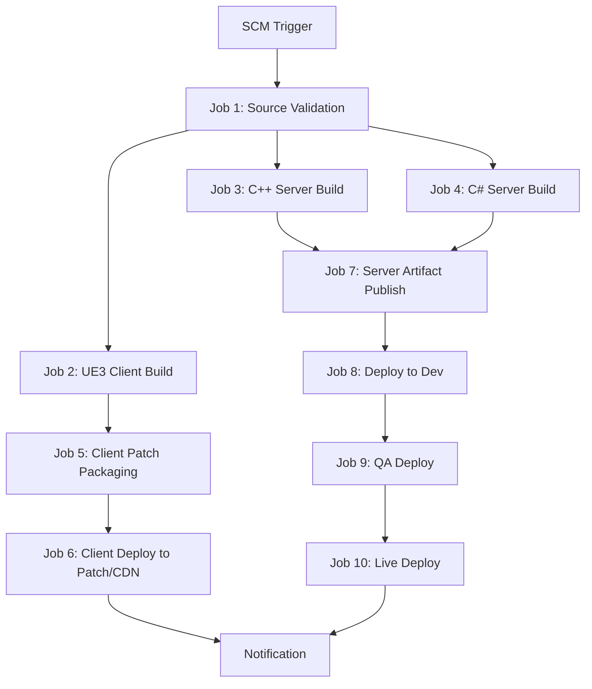
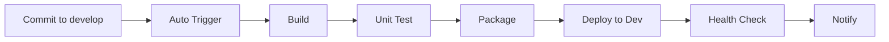
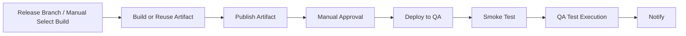
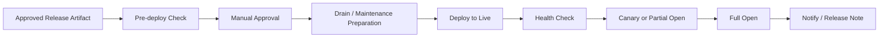
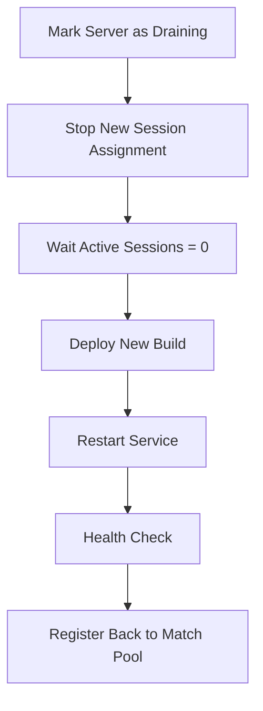

# 1. Jenkins Job 분리 방식

실무에서는 하나의 거대한 파이프라인으로 전부 처리하기보다, **역할별 Job을 나누고 upstream/downstream 관계로 연결하는 방식**이 운영하기 편하다.  
이유는 다음과 같다.

- 클라이언트 빌드 시간과 서버 빌드 시간이 크게 다름
- UE3 전용 Windows 노드가 따로 필요함
- 서버만 재배포하거나 클라이언트만 재배포하는 경우가 많음
- 운영 배포 승인 단계를 중간에 넣기 쉬움
- 실패 지점을 빠르게 구분할 수 있음

권장 Job 구조는 다음과 같다.



---

# 2. 권장 Job 목록

최소한 아래 정도로 쪼개는 것이 좋다.

## 2-1. 공통 Job
- `validate-source`
- `publish-artifact`
- `notify-result`
- `rollback-server`

## 2-2. 클라이언트 Job
- `build-ue3-client`
- `package-client-patch`
- `deploy-client-dev`
- `deploy-client-qa`
- `deploy-client-live`

## 2-3. 서버 Job
- `build-cpp-server`
- `build-csharp-server`
- `deploy-server-dev`
- `deploy-server-qa`
- `deploy-server-live`

이렇게 나누면 예를 들어 서버만 긴급 패치가 필요할 때 클라이언트 파이프라인과 독립적으로 처리 가능하다.

---

# 3. 추천 Jenkins 폴더 구조

Jenkins 내부에서도 폴더를 분리하는 것이 좋다.

```text
Jenkins
 ┣ GameProject
 ┃ ┣ Common
 ┃ ┃ ┣ validate-source
 ┃ ┃ ┣ publish-artifact
 ┃ ┃ ┣ notify-result
 ┃ ┃ ┗ rollback-server
 ┃ ┣ Client
 ┃ ┃ ┣ build-ue3-client
 ┃ ┃ ┣ package-client-patch
 ┃ ┃ ┣ deploy-client-dev
 ┃ ┃ ┣ deploy-client-qa
 ┃ ┃ ┗ deploy-client-live
 ┃ ┣ Server-CPP
 ┃ ┃ ┣ build-cpp-server
 ┃ ┃ ┣ deploy-server-dev
 ┃ ┃ ┣ deploy-server-qa
 ┃ ┃ ┗ deploy-server-live
 ┃ ┗ Server-CS
 ┃    ┣ build-csharp-server
 ┃    ┣ deploy-server-dev
 ┃    ┣ deploy-server-qa
 ┃    ┗ deploy-server-live
```

이렇게 해두면 권한 분리도 쉽다.

예:
- 빌드 담당자 → Build Job만 실행 가능
- 운영 담당자 → Live Deploy 권한만 보유
- QA 담당자 → QA Deploy 권한 보유

---

# 4. 환경별 실제 배포 흐름

게임 프로젝트에서는 환경별로 동작이 달라야 한다.

---

# 5. Dev 환경 배포 흐름

Dev는 가장 자동화 수준이 높아야 한다.

## 목적
- 개발자가 머지한 내용을 빠르게 검증
- 서버 기동 여부와 기본 기능 확인
- 클라이언트 내부 패치 테스트

## 흐름



## 특징
- 자동 트리거
- 자동 배포
- 실패 시 즉시 알림
- 승인 단계 없음

Dev는 속도가 중요하므로, 빌드 이후 가능한 빠르게 반영되도록 구성하는 편이 좋다.

---

# 6. QA 환경 배포 흐름
QA는 릴리스 검증 구간이다.

## 목적
- 테스트 대상 빌드 고정
- 기능 테스트, 회귀 테스트 수행
- 운영 배포 전 최종 검증

## 흐름


## 특징
- Dev에서 성공한 동일 아티팩트를 재사용하는 것이 좋다
- QA용으로 다시 빌드하지 않는 편이 좋다
- QA 배포 전 승인 가능
- Smoke Test 후 본 테스트 진행

즉 QA는 “재빌드”보다 “검증 대상 산출물 고정”이 더 중요하다.

---

# 7. Live 환경 배포 흐름
운영은 가장 보수적으로 가야 한다.

## 목적
- 서비스 중단 최소화
- 세션 안정성 확보
- 장애 발생 시 신속 롤백

## 흐름



## 특징
- 반드시 승인 단계 포함
- 사전 점검 포함
- 로그인 서버/로비 서버/매치 서버 배포 순서 분리
- 헬스체크 후 트래픽 점진 반영
- 롤백 버튼 또는 Job 별도 준비

---

# 8. 게임 서버 배포 순서 설계

게임 서버는 보통 단일 서버가 아니라 역할별 서버가 나뉜다.
예를 들어 아래와 같이 나뉠 수 있다.
- Auth/Login Server
- Lobby Server
- Channel Server
- Match Server
- Chat Server
- Game Logic Worker
- Gateway

이 경우 운영 배포 순서를 잘 설계해야 한다.

## 권장 순서 예시
1. 내부 공통 서비스
2. Gateway 또는 Edge 계층
3. Login/Auth
4. Lobby
5. Match/Channel
6. 비동기 Worker

하지만 실제로는 서비스 의존성에 따라 달라진다.  
중요한 것은 **사용자 유입 경로 앞단을 마지막에 바꾸거나, drain 후 교체하는 구조**를 만드는 것이다.

---

# 9. Match Server 같은 세션형 서버 배포 전략
웹 서버처럼 그냥 재시작하면 안 된다.  
세션이 살아 있는 동안 프로세스를 바꾸면 사용자 게임 세션이 끊어진다.

권장 방식은 아래와 같다.

## 단계

1. 서버를 매치 할당 목록에서 제외
2. 신규 세션 유입 차단
3. 현재 세션 수 확인
4. 세션 종료까지 대기
5. 배포 수행
6. 재기동 후 등록
7. 헬스체크 후 다시 매치 할당 가능 상태로 전환

## 개념도


이 구조가 없으면 운영 배포마다 게임방 강제 종료 문제가 생길 수 있다.

---

# 10. Windows 서비스형 게임 서버 배포 상세 시나리오
Windows 기반 게임 서버가 서비스로 등록되어 있다고 가정하면 다음 절차가 일반적이다.

## 절차
1. 배포 대상 서버 선택
2. 현재 active 버전 확인
3. 신규 zip 복사
4. 신규 release 디렉토리 생성
5. 압축 해제
6. 설정 파일 주입
7. 서비스 중지
8. `active` 링크 전환
9. 서비스 시작
10. 포트/프로세스/로그인 헬스체크
11. 실패 시 이전 버전으로 롤백

---

# 11. 배포 서버 디렉토리 구조 예시

```text
D:\GameServers\
 ┣ releases\
 ┃ ┣ 20260420_150000\
 ┃ ┣ 20260420_173000\
 ┃ ┗ 20260421_090000\
 ┣ active -> D:\GameServers\releases\20260421_090000
 ┣ config\
 ┃ ┣ Dev\
 ┃ ┣ QA\
 ┃ ┗ Live\
 ┣ logs\
 ┗ scripts\
```

이 구조의 장점은 다음과 같다.
- release 디렉토리별 버전 보존
- active 링크만 바꿔 롤백 가능
- 설정 파일과 바이너리 분리 가능
- 로그 보존이 쉬움

---

# 12. 환경별 설정 관리 방식
설정 파일을 바이너리와 같이 묶어버리면 운영 중 수정이 어렵고 배포도 위험해진다.  
권장 방식은 “바이너리와 설정 분리”이다.

예를 들면 다음과 같다.

```text
active\
 ┣ bin\
 ┣ data\
 ┗ config -> D:\GameServers\config\Live
```

또는 배포 시점에 환경별 설정을 덮어쓰는 구조도 가능하다.

예:
- `server.dev.json`
- `server.qa.json`
- `server.live.json`

배포 스크립트가 환경에 맞는 설정을 선택하여 주입하도록 만들면 된다.

---

# 13. 서버 배포 PowerShell 예시

아래는 좀 더 현실적인 형태의 예시이다.

`deploy-server-live.ps1`

```powershell
param(
    [string]$ArtifactZip,
    [string]$TargetServer,
    [string]$ServiceName,
    [string]$BaseDir = "D:\GameServers",
    [string]$EnvName = "Live"
)

$ErrorActionPreference = "Stop"

$releaseName = Get-Date -Format "yyyyMMdd_HHmmss"
$releaseDir = "$BaseDir\releases\$releaseName"
$configSource = "$BaseDir\config\$EnvName"

Write-Host "Deploying $ArtifactZip to $TargetServer"

$session = New-PSSession -ComputerName $TargetServer

Copy-Item $ArtifactZip -Destination "C:\Temp\deploy.zip" -ToSession $session -Force

Invoke-Command -Session $session -ScriptBlock {
    param($releaseDir, $configSource, $serviceName, $baseDir)

    New-Item -ItemType Directory -Force -Path $releaseDir | Out-Null
    Expand-Archive -Path "C:\Temp\deploy.zip" -DestinationPath $releaseDir -Force

    $configTarget = Join-Path $releaseDir "config"
    if (Test-Path $configTarget) {
        Remove-Item $configTarget -Recurse -Force
    }

    Copy-Item $configSource $configTarget -Recurse -Force

    Stop-Service $serviceName -Force

    $active = Join-Path $baseDir "active"
    if (Test-Path $active) {
        Remove-Item $active -Force
    }

    New-Item -ItemType SymbolicLink -Path $active -Target $releaseDir | Out-Null

    Start-Service $serviceName
} -ArgumentList $releaseDir, $configSource, $ServiceName, $BaseDir

Remove-PSSession $session
```

이 스크립트는 아주 중요한 두 가지를 보여준다.
- 배포 대상 디렉토리를 새로 만들고 압축을 푼다
- 설정을 별도로 주입한 후 active 링크만 바꾼다

즉 덮어쓰기 방식보다 안전하다.

---

# 14. 헬스체크 스크립트 예시
운영 배포 후에는 프로세스 기동만 보지 말고 실제 서비스 확인을 해야 한다.
`health-check.ps1`

```powershell
param(
    [string]$Host = "127.0.0.1",
    [int]$Port = 7001
)

$maxRetry = 10
$intervalSec = 5
$success = $false

for ($i = 1; $i -le $maxRetry; $i++) {
    try {
        $client = New-Object System.Net.Sockets.TcpClient
        $client.Connect($Host, $Port)

        if ($client.Connected) {
            Write-Host "Health check success on $Host:$Port"
            $client.Close()
            $success = $true
            break
        }
    }
    catch {
        Write-Host "Health check failed. retry=$i"
    }

    Start-Sleep -Seconds $intervalSec
}

if (-not $success) {
    throw "Health check failed after retries"
}
```

실무에서는 여기에 더해 아래 항목도 검사하는 것이 좋다.
- DB Ping
- Redis or Cache 연결
- 로그인 패킷 응답
- 버전 확인 API
- 매치 풀 등록 상태

---

# 15. 롤백 스크립트 예시
운영에서는 “배포 스크립트”만큼 “롤백 스크립트”가 중요하다.
`rollback-server.ps1`

```powershell
param(
    [string]$TargetServer,
    [string]$ServiceName,
    [string]$BaseDir = "D:\GameServers",
    [string]$PreviousRelease = "D:\GameServers\releases\20260420_173000"
)

$session = New-PSSession -ComputerName $TargetServer

Invoke-Command -Session $session -ScriptBlock {
    param($serviceName, $baseDir, $previousRelease)

    Stop-Service $serviceName -Force

    $active = Join-Path $baseDir "active"
    if (Test-Path $active) {
        Remove-Item $active -Force
    }

    New-Item -ItemType SymbolicLink -Path $active -Target $previousRelease | Out-Null

    Start-Service $serviceName
} -ArgumentList $ServiceName, $BaseDir, $PreviousRelease

Remove-PSSession $session
```

즉 롤백은 “이전 바이너리 재복사”가 아니라 “이전 릴리스 포인터 복구” 형태가 가장 빠르고 안전하다.

---

# 16. UE3 클라이언트 Job 체인 상세 설계
클라이언트는 보통 아래 3단계로 나누는 것이 좋다.

## 16-1. Job 1: build-ue3-client

역할:
- 코드 체크아웃
- 버전 정보 삽입
- 스크립트/코드 빌드
- Cook/Package 수행
- 원본 빌드 결과 생성

## 16-2. Job 2: package-client-patch

역할:
- 변경 파일 해시 계산
- manifest 생성
- 패치 단위 분리
- zip 또는 patch chunk 생성

## 16-3. Job 3: deploy-client-live

역할:
- 패치 서버 업로드
- latest version 포인터 갱신
- CDN 캐시 무효화
- 런처 배포 정보 갱신

이렇게 분리하면 클라이언트 패치 생성 로직만 수정할 때, UE3 전체 빌드를 다시 만지지 않아도 된다.

---

# 17. 클라이언트 패치 버전 파일 예시
예를 들어 런처가 읽는 버전 파일은 아래처럼 둘 수 있다.
`latest.json`

```json
{
  "version": "1.2.0",
  "build": "152",
  "manifestUrl": "https://cdn.example.com/game/1.2.0/manifest.json",
  "baseUrl": "https://cdn.example.com/game/1.2.0/files/"
}
```

런처는 이 파일을 보고 최신 버전을 판단한다.

---

# 18. Jenkins Declarative Pipeline을 Job별로 나누는 예시

아래는 서버 Dev 배포 Job 예시이다.

```groovy
pipeline {
    agent { label 'windows-deploy' }

    parameters {
        string(name: 'ARTIFACT_NAME', defaultValue: 'GameServerCpp.zip', description: 'Artifact file')
        string(name: 'TARGET_SERVER', defaultValue: 'dev-game-01', description: 'Deploy target')
        string(name: 'SERVICE_NAME', defaultValue: 'GameServerCpp', description: 'Windows service name')
    }

    stages {
        stage('Fetch Artifact') {
            steps {
                powershell '''
                Copy-Item "D:\\artifact-repo\\${env:ARTIFACT_NAME}" "D:\\deploy\\${env:ARTIFACT_NAME}" -Force
                '''
            }
        }

        stage('Deploy') {
            steps {
                powershell '''
                .\\scripts\\deploy-server-live.ps1 `
                  -ArtifactZip "D:\\deploy\\${env:ARTIFACT_NAME}" `
                  -TargetServer "${env:TARGET_SERVER}" `
                  -ServiceName "${env:SERVICE_NAME}" `
                  -EnvName "Dev"
                '''
            }
        }

        stage('Health Check') {
            steps {
                powershell '''
                .\\scripts\\health-check.ps1 -Host "${env:TARGET_SERVER}" -Port 7001
                '''
            }
        }
    }

    post {
        success {
            echo "Dev deploy success"
        }
        failure {
            echo "Dev deploy failed"
        }
    }
}
```

---

# **19. 실제 운영에서 추가하면 좋은 것들**

## **19-1. Build Metadata 삽입**

각 바이너리 또는 설정에 다음 값을 남기는 것이 좋다.

- version
- build number
- commit hash
- built at
- built by pipeline

클라이언트와 서버가 서로 버전이 맞는지 검증할 때 유용하다.

예를 들어 로그인 시 클라이언트 버전과 서버 허용 버전을 비교하게 만들 수 있다.

---

## **19-2. 심볼 파일 보관**

C++ 서버는 장애 분석을 위해 다음을 보관해야 한다.

- `.pdb`
- map 파일
- 심볼 전용 저장소

운영 장애가 났을 때 crash dump 분석을 하려면 이 파일들이 반드시 필요하다.

---

## **19-3. DB Migration 분리**

게임 서버 배포에 DB 스키마 변경이 포함된다면, 서버 배포와 DB Migration Job을 분리하는 것이 좋다.

권장 순서:

1. backward compatible schema 추가
2. 서버 배포
3. 기능 전환
4. 구 스키마 제거

즉 DB 변경을 서버 재시작과 한 번에 묶어버리면 위험하다.

---

# **20. 최종 추천 구조**

가장 현실적인 구조를 한 번에 정리하면 아래와 같다.

## **클라이언트**

- 전용 Windows 노드
- UE3 Build Job
- Patch Packaging Job
- CDN/Patch Deploy Job

## **C++ 서버**

- Windows Build Node
- Build Job
- Artifact Publish Job
- Dev/QA/Live Deploy Job
- Rollback Job

## **C# 서버**

- dotnet Build Job
- Publish Job
- Dev/QA/Live Deploy Job
- Rollback Job

## **공통**

- 아티팩트 저장소
- 버전/빌드 메타데이터
- 헬스체크
- 승인 단계
- 알림
- 롤백

---

# **21. 결론**

실무에서는 “게임 클라이언트와 게임 서버를 하나의 CI/CD로 묶는다”기보다,  
**공통 릴리스 체계 아래에서 서로 다른 빌드/배포 파이프라인을 운영한다**고 보는 편이 맞다.

정리하면 다음과 같다.

- UE3 클라이언트는 전용 빌드 머신과 패치 배포 체계가 필요하다.
- C++/C# 서버는 언어별 표준 빌드 체인을 따르되, 운영 배포는 세션 특성을 고려해야 한다.
- Jenkins는 하나의 거대한 Job보다 역할별 Job 체인으로 구성하는 것이 좋다.
- 운영 배포는 반드시 헬스체크, 승인, 롤백을 포함해야 한다.

원하면 다음에는 이어서  
**실제로 Jenkins에서 Multibranch/Parameterized Job을 어떻게 나누는지**,  
또는 **Windows 서비스형 게임 서버를 여러 대에 순차 배포하는 스크립트**를 더 구체적으로 작성하겠다.