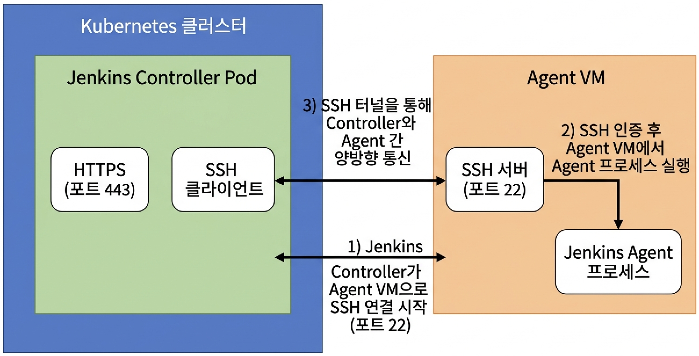
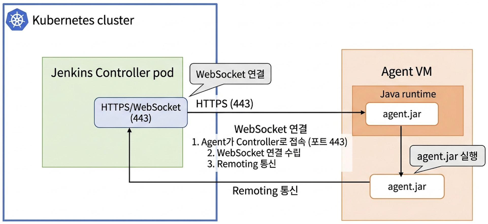

## Jenkins Agent의 동작 방식

Jenkins에서 Pipeline을 실행하면 Jenkins Controller가 모든 작업을 직접 수행하는 것이 아니라, 실제 빌드 작업은 Agent에서 수행된다. Jenkins Controller는 작업을 스케줄링하고, 어떤 Agent에서 Job을 실행할지 결정한다. Agent는 Controller로부터 작업을 전달받아 Shell Script, Build, Test, Deploy 같은 실제 명령을 실행한다.

Jenkins Agent를 연결하는 방법은 여러 가지가 있다. 대표적으로 SSH 방식, Inbound Agent 방식, Kubernetes Pod Agent 방식 등이 있다.

SSH Agent 방식은 Jenkins Controller가 Agent 대상 서버로 SSH 접속하여 Agent 프로세스를 실행하는 방식이다. 반대로 Inbound Agent 방식은 Agent 서버가 Jenkins Controller로 먼저 접속하는 방식이다. 즉 연결 방향이 다르다.

```text
[SSH Agent]
Jenkins Controller → Agent VM

[Inbound Agent]
Agent VM → Jenkins Controller
```


*SSH Agent 구성도*


*Inbound Agent 구성도*

Inbound Agent 방식은 방화벽이나 폐쇄망 환경에서 유리하다. Jenkins Controller에서 Agent VM으로 SSH 접근이 불가능하더라도, Agent VM에서 Jenkins Controller로 HTTPS 접근만 가능하면 연결할 수 있기 때문이다.


## Inbound Agent와 WebSocket

Inbound Agent는 예전에는 JNLP Agent라고도 불렸다. 현재는 보통 Inbound Agent라고 부르는 것이 더 적절하다. Inbound Agent는 Agent 프로세스가 Jenkins Controller로 먼저 연결을 생성한다.
WebSocket을 사용하지 않는 일반 Inbound Agent는 Jenkins의 Web URL에 먼저 접근한 뒤, 별도의 TCP Agent Port를 통해 Jenkins Remoting 통신을 수행한다.

```text
Agent VM
  → Jenkins HTTPS URL
  → Jenkins TCP Agent Port
  → Remoting 통신
```

반면 WebSocket 방식을 사용하면 Jenkins Remoting 통신이 HTTP(S) WebSocket 위에서 수행된다. WebSocket은 HTTP(S) 포트 위에서 양방향 스트리밍 통신을 제공하는 방식이다. Jenkins WebSocket Agent는 별도의 TCP Agent Port를 열지 않고 Jenkins의 HTTP(S) 포트만으로 Agent 연결을 수행할 수 있다. 

```text
Agent VM
  → Jenkins HTTPS / WebSocket
  → Remoting 통신
```

즉 WebSocket 방식에서는 Agent VM에서 Jenkins Controller의 `443` 또는 `8080` 포트로만 접근 가능하면 된다. Jenkins 공식 블로그에서도 WebSocket은 HTTP(S) port를 통해 bidirectional streaming communication을 제공한다고 설명한다.  

이 구조는 Reverse Proxy, Ingress, Load Balancer 뒤에 Jenkins가 있는 환경에서 특히 편하다. Jenkins Kubernetes Plugin 문서에서도 WebSocket을 사용하면 Agent가 Jenkins Service TCP Port가 아니라 HTTP(S)를 통해 연결되므로, Controller가 Ingress나 Reverse Proxy 뒤에 있을 때 구성이 단순해진다고 설명한다.  


## 전체 구성 흐름

이번 테스트에서는 Jenkins Controller가 HTTPS로 구성되어 있고, 별도의 SSH 연결 없이 특정 VM을 Jenkins Agent로 사용하도록 구성하였다.

전체 흐름은 다음과 같다.

```text
1. Jenkins에서 신규 Node 생성
2. Launch method를 Inbound Agent 방식으로 설정
3. WebSocket 옵션 사용
4. Agent 대상 VM에서 agent.jar 다운로드
5. Jenkins HTTPS 인증서를 Java truststore에 등록
6. java -jar agent.jar 명령으로 Agent 실행
7. Jenkins Node가 Online 상태인지 확인
8. Pipeline에서 특정 label을 지정하여 Job 실행
```

구조로 보면 다음과 같다.

```text
Jenkins Controller
  - HTTPS 사용
  - Inbound Agent Node 등록
  - WebSocket 연결 허용

Agent VM
  - Java 설치
  - agent.jar 다운로드
  - Jenkins CA 인증서 등록
  - agent.jar 실행

Pipeline
  - label로 Agent VM 지정
  - 해당 VM에서 Job 실행
```


## 작업 진행
### 1. Jenkins에서 Node 생성

먼저 Jenkins UI에서 새로운 Node를 생성한다.

```text
Manage Jenkins
  → Nodes
  → New Node
```

Node 이름은 테스트 기준으로 다음과 같이 지정한다.

```text
vm-agent-01
```

Node Type은 `Permanent Agent`를 선택한다.

주요 설정은 다음과 같다.

```text
Name: vm-agent-01
Number of executors: 1
Remote root directory: /home/jenkins/agent
Labels: vm-agent linux build
Usage: Only build jobs with label expressions matching this node
Launch method: Launch agent by connecting it to the controller
Use WebSocket: 체크
```

여기서 중요한 부분은 `Launch method`이다.

```text
Launch agent by connecting it to the controller
```

이 설정이 Inbound Agent 방식이다. 즉 Jenkins Controller가 Agent VM으로 접속하는 것이 아니라, Agent VM이 Jenkins Controller로 접속한다.

그리고 WebSocket 옵션을 사용하면 Agent는 별도의 TCP Agent Port가 아니라 Jenkins의 HTTPS URL을 통해 WebSocket 연결을 생성한다. CloudBees 문서에서도 Permanent Agent를 WebSocket enabled 상태로 만들고, Launch method를 `Launch agent by connecting it to the controller`로 구성한다고 설명한다.  

### 2. Agent VM 준비

Agent로 사용할 VM에는 Java가 필요하다. Jenkins Agent는 `agent.jar`를 Java로 실행하는 구조이기 때문이다. Jenkins 공식 문서에서도 inbound agent를 실행하려면 agent machine에 Java가 필요하다고 설명한다.  

Ubuntu 기준으로 Java를 설치한다.

```bash
sudo apt-get update
sudo apt-get install -y openjdk-17-jre curl openssl
```

설치 후 Java 버전을 확인한다.

```bash
java -version
```

Agent 전용 계정과 작업 디렉터리를 생성한다.

```bash
sudo useradd -m -s /bin/bash jenkins
sudo mkdir -p /home/jenkins/agent
sudo chown -R jenkins:jenkins /home/jenkins/agent
```

### 3. agent.jar 다운로드

Jenkins Agent는 Jenkins Controller에서 제공하는 `agent.jar`를 받아 실행한다. Jenkins에서는 `/jnlpJars/agent.jar` 경로를 통해 Agent 실행에 필요한 jar 파일을 제공한다. Jenkins 권한 문서에서도 `/jnlpJars/` 경로는 `agent.jar`, `remoting.jar`, `jenkins-cli.jar` 같은 client package를 다운로드하기 위한 경로라고 설명한다.  

Agent VM에서 다음과 같이 다운로드한다.

```bash
sudo -u jenkins bash
cd /home/jenkins/agent

curl -O https://jenkins.example.com/jnlpJars/agent.jar
```

Jenkins가 사설 인증서 또는 내부 CA 인증서를 사용하고 있다면 `curl`에서 인증서 검증 오류가 발생할 수 있다.

테스트 목적으로는 다음처럼 받을 수도 있다.

```bash
curl -k -O https://jenkins.example.com/jnlpJars/agent.jar
```

다만 `curl -k`는 임시 확인용으로만 사용하는 것이 좋다. 실제 Agent 실행 시에는 Java가 Jenkins HTTPS 인증서를 신뢰해야 하므로, Java truststore에 인증서를 등록해야 한다.

### 4. Jenkins HTTPS 인증서 확인

Jenkins가 HTTPS로 구성되어 있으면 Agent VM에서 `java -jar agent.jar` 실행 시 다음과 같은 오류가 발생할 수 있다.

```text
javax.net.ssl.SSLHandshakeException:
PKIX path building failed:
sun.security.provider.certpath.SunCertPathBuilderException:
unable to find valid certification path to requested target
```

이 오류는 Agent VM의 Java truststore가 Jenkins HTTPS 인증서를 신뢰하지 못한다는 의미이다.

먼저 Jenkins 서버가 제공하는 인증서 체인을 확인한다.

```bash
openssl s_client \
  -connect jenkins.example.com:443 \
  -servername jenkins.example.com \
  -showcerts
```

출력에는 보통 Jenkins 서버 인증서와 Intermediate CA 인증서가 포함된다.

```text
-----BEGIN CERTIFICATE-----
Jenkins Server Certificate
-----END CERTIFICATE-----

-----BEGIN CERTIFICATE-----
Intermediate CA Certificate
-----END CERTIFICATE-----
```

여기서 주의할 점은 `-showcerts`로 보이는 내용은 공개 인증서라는 점이다. 인증서는 TLS 연결 과정에서 원래 클라이언트에게 공개되는 정보이다. 보안적으로 보호해야 하는 것은 인증서가 아니라 private key이다.

즉 truststore에 넣어야 하는 것은 다음이다.

```text
OK:
Root CA Certificate
Intermediate CA Certificate
Jenkins Server Certificate

절대 공유하면 안 되는 것:
Root CA Private Key
Intermediate CA Private Key
Jenkins Server Private Key
```

운영 환경에서는 `openssl s_client -showcerts`에서 추출한 인증서보다 보안팀 또는 인증서 담당자가 제공한 Root CA 또는 Intermediate CA 인증서를 사용하는 것이 좋다.

### 5. Java truststore에 인증서 등록

Agent VM에서 Jenkins HTTPS 인증서를 신뢰하도록 Java truststore에 CA 인증서를 등록한다.

예를 들어 내부 CA 인증서를 `/tmp/jenkins-ca.crt`로 준비했다고 가정한다.

```bash
ls -l /tmp/jenkins-ca.crt
```

인증서 파일은 보통 다음과 같은 PEM 형식이다.

```text
-----BEGIN CERTIFICATE-----
...
-----END CERTIFICATE-----
```

Java의 기본 truststore 위치를 확인한다.

```bash
java -XshowSettings:properties -version 2>&1 | grep 'java.home'
```

Ubuntu OpenJDK 17 기준으로는 보통 다음 경로를 사용한다.

```text
/usr/lib/jvm/java-17-openjdk-amd64/lib/security/cacerts
```

인증서를 등록한다.

```bash
sudo keytool -importcert \
  -alias jenkins-ca \
  -file /tmp/jenkins-ca.crt \
  -keystore /usr/lib/jvm/java-17-openjdk-amd64/lib/security/cacerts \
  -storepass changeit \
  -noprompt
```

등록 여부를 확인한다.

```bash
keytool -list \
  -keystore /usr/lib/jvm/java-17-openjdk-amd64/lib/security/cacerts \
  -storepass changeit \
  | grep jenkins-ca
```

시스템 Java truststore를 직접 수정하고 싶지 않다면 별도의 truststore를 만들어서 Agent 실행 시 지정할 수도 있다.

```bash
sudo -u jenkins keytool -importcert \
  -alias jenkins-ca \
  -file /tmp/jenkins-ca.crt \
  -keystore /home/jenkins/agent/jenkins-truststore.jks \
  -storepass changeit \
  -noprompt
```

이 방식은 Jenkins Agent 실행에만 별도 truststore를 사용할 수 있다는 장점이 있다.

### 6. Agent 실행

Jenkins Node 페이지에 들어가면 Agent 실행 명령이 표시된다. 일반적으로 다음과 같은 형식이다.

```bash
java -jar agent.jar \
  -url https://jenkins.example.com/ \
  -secret <SECRET> \
  -name vm-agent-01 \
  -workDir "/home/jenkins/agent"
```

WebSocket을 명시적으로 사용할 경우 다음과 같이 실행한다.

```bash
cd /home/jenkins/agent

java -jar agent.jar \
  -url https://jenkins.example.com/ \
  -secret '<SECRET>' \
  -name 'vm-agent-01' \
  -webSocket \
  -workDir '/home/jenkins/agent'
```

별도 truststore를 사용하는 경우에는 Java 옵션을 함께 지정한다.

```bash
java \
  -Djavax.net.ssl.trustStore=/home/jenkins/agent/jenkins-truststore.jks \
  -Djavax.net.ssl.trustStorePassword=changeit \
  -jar /home/jenkins/agent/agent.jar \
  -url https://jenkins.example.com/ \
  -secret '<SECRET>' \
  -name 'vm-agent-01' \
  -webSocket \
  -workDir '/home/jenkins/agent'
```

정상적으로 연결되면 Agent VM 로그에 다음과 유사한 메시지가 출력된다.

```text
INFO: Using /home/jenkins/agent/remoting as a remoting work directory
INFO: WebSocket connection open
INFO: Connected
```

Jenkins UI에서도 해당 Node가 Online 상태로 변경된다.


### 7. systemd 서비스 등록

수동 실행으로 정상 연결이 확인되면 systemd 서비스로 등록한다. 이렇게 하면 VM 재부팅 후에도 Agent가 자동으로 Jenkins Controller에 다시 연결된다.

```bash
sudo vi /etc/systemd/system/jenkins-agent.service
```

내용은 다음과 같다.

```ini
[Unit]
Description=Jenkins Inbound WebSocket Agent
After=network.target

[Service]
User=jenkins
Group=jenkins
WorkingDirectory=/home/jenkins/agent

ExecStart=/usr/bin/java \
  -Djavax.net.ssl.trustStore=/home/jenkins/agent/jenkins-truststore.jks \
  -Djavax.net.ssl.trustStorePassword=changeit \
  -jar /home/jenkins/agent/agent.jar \
  -url https://jenkins.example.com/ \
  -secret YOUR_AGENT_SECRET \
  -name vm-agent-01 \
  -webSocket \
  -workDir /home/jenkins/agent

Restart=always
RestartSec=10

[Install]
WantedBy=multi-user.target
```

서비스를 적용한다.

```bash
sudo systemctl daemon-reload
sudo systemctl enable --now jenkins-agent
sudo systemctl status jenkins-agent
```

로그는 다음 명령으로 확인한다.

```bash
journalctl -u jenkins-agent -f
```


## 테스트
### 1. Pipeline에서 Agent Label 지정

Jenkins Node 생성 시 `Labels`에 다음 값을 지정했다고 가정한다.

```text
vm-agent
```

Pipeline에서는 이 label을 사용하여 해당 Agent VM에서 Job을 실행할 수 있다.

```groovy
pipeline {
    agent {
        label 'vm-agent'
    }

    stages {
        stage('Agent Info') {
            steps {
                sh '''
                  echo "===== Jenkins Agent Test ====="
                  echo "HOSTNAME: $(hostname)"
                  echo "USER: $(whoami)"
                  echo "PWD: $(pwd)"
                  echo "WORKSPACE: ${WORKSPACE}"
                  echo

                  echo "===== Java Version ====="
                  java -version || true
                  echo

                  echo "===== OS Info ====="
                  uname -a
                  cat /etc/os-release || true
                  echo

                  echo "===== Jenkins Env ====="
                  echo "NODE_NAME=${NODE_NAME}"
                  echo "EXECUTOR_NUMBER=${EXECUTOR_NUMBER}"
                  echo "BUILD_NUMBER=${BUILD_NUMBER}"
                  echo "JOB_NAME=${JOB_NAME}"
                '''
            }
        }

        stage('Workspace Write Test') {
            steps {
                sh '''
                  echo "test from Jenkins inbound websocket agent" > agent-test.txt
                  cat agent-test.txt
                  ls -al
                '''
            }
        }
    }

    post {
        always {
            echo "Agent test pipeline finished."
        }
    }
}
```

이 Pipeline을 실행하면 Jenkins는 `vm-agent` label을 가진 Node를 찾는다. 해당 label을 가진 Agent가 Online 상태라면 그 Agent VM에서 Pipeline이 실행된다.

실행 결과에서 다음 값을 확인하면 된다.

```text
HOSTNAME
USER
PWD
WORKSPACE
NODE_NAME
```

`HOSTNAME`이 Agent VM의 hostname으로 출력되면 해당 VM에서 Job이 실행된 것이다.

### 2. 특정 Stage만 Agent VM에서 실행

전체 Pipeline을 특정 Agent에 묶지 않고, 일부 Stage만 Agent VM에서 실행할 수도 있다.

```groovy
pipeline {
    agent none

    stages {
        stage('Run on Inbound Agent') {
            agent {
                label 'vm-agent'
            }

            steps {
                sh '''
                  echo "This stage is running on inbound websocket agent"
                  hostname
                  whoami
                  pwd
                  echo "NODE_NAME=${NODE_NAME}"
                  echo "WORKSPACE=${WORKSPACE}"
                '''
            }
        }

        stage('Build Example') {
            agent {
                label 'vm-agent'
            }

            steps {
                sh '''
                  mkdir -p build
                  date > build/result.txt
                  cat build/result.txt
                '''
            }
        }
    }
}
```

이 방식은 여러 Agent를 함께 사용하는 Pipeline에서 유용하다. 예를 들어 빌드는 Linux Agent에서 수행하고, 배포는 특정 네트워크에 접근 가능한 Agent VM에서만 수행하도록 나눌 수 있다.


## WebSocket을 사용했을 때와 사용하지 않았을 때의 차이

WebSocket 옵션을 사용하지 않는 Inbound Agent는 Jenkins의 별도 TCP Agent Port가 필요할 수 있다.

```text
Agent VM
  → Jenkins HTTPS
  → Jenkins TCP Agent Port
```

이 경우 Jenkins 설정에서 다음 항목을 확인해야 한다.

```text
Manage Jenkins
  → Security
  → TCP port for inbound agents
```

Jenkins 공식 보안 문서에서도 Jenkins는 inbound agent 연결을 위해 TCP port를 expose할 수 있으며, 해당 포트는 Jenkins 보안 설정에서 enable, disable, configure할 수 있다고 설명한다.  

반면 WebSocket 방식은 Jenkins의 HTTP(S) URL을 통해 Agent 연결을 수행한다.

```text
Agent VM
  → Jenkins HTTPS / WebSocket
```

따라서 방화벽 정책이 단순해진다.

```text
WebSocket 사용:
Agent VM → Jenkins Controller: 443

WebSocket 미사용:
Agent VM → Jenkins Controller: 443
Agent VM → Jenkins Controller: 50000 등 TCP Agent Port
```

이번 테스트에서는 Jenkins가 HTTPS로 구성되어 있고, Agent VM에서 Jenkins Controller로 HTTPS 접근이 가능했기 때문에 WebSocket 방식을 사용하였다.