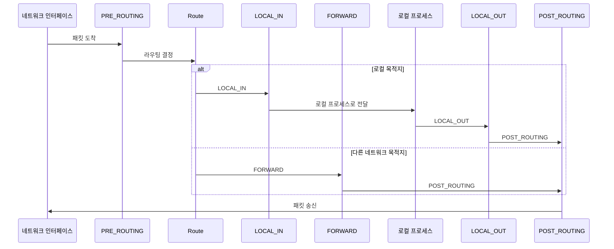
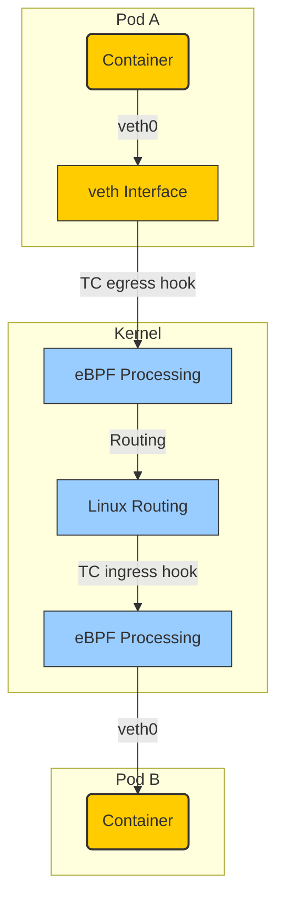

## **Cilium CNI 란?**
Cilium은 현대적인 클라우드 네이티브 환경을 위한 강력한 네트워킹 솔루션입니다. 2023년 Cloud Native Computing Foundation (CNCF)의 졸업 프로젝트로 인정받은 Cilium은 Kubernetes의 Container Network Interface (CNI) 표준을 완벽히 지원합니다.

쿠버네티스 생태계에서 CNI 솔루션은 크게 두 가지 접근 방식으로 나눌 수 있습니다:

1. 전통적 접근: Calico와 같은 솔루션은 iptables, IPVS 등 기존 Linux 커널 기능(netfilter)을 활용
2. 혁신적 접근: Cilium은 eBPF (extended Berkeley Packet Filter) 기술을 활용

Cilium의 eBPF 기반 접근 방식이 전통적인 iptables 기반 솔루션보다 [네트워크 성능이 좋은 이유](https://cilium.io/blog/2021/05/11/cni-benchmark/#env)는 eBPF 기술이 제공하는 다양한 장점 때문입니다. (참고: [CNI Benchmark: Understanding Cilium Network Performance](https://cilium.io/blog/2021/05/11/cni-benchmark/#env))

### Cilium이 네트워킹 기술로 eBPF(extended Berkeley Packet Filter)를 사용하는이유
#### iptables의 문제
- 단일 트랜잭션에는 모든 규칙을 다시 생성하고 업데이트
- 규칙 체인을 연결된 목록으로 구현하므로 모든 작업이 O(n)입니다.
- L7 프로토콜에 대한 인식이 없는 IP와 포트 매칭(네트워크 계층)을 기반으로 합니다.
- 매칭할 새로운 IP 또는 포트가 있을 때마다 규칙을 추가하고 체인을 변경해야 합니다.  
  -> Kubernetes에서 리소스를 많이 소비합니다.

위에서 언급한 문제들로 인해 트래픽이 많은 조건이나 iptables 규칙을 많이 변경하는 시스템에서는 성능이 저하되며 서비스 수가 증가함에 따라 예측할 수 없는 지연 시간과 성능 저하가 나타납니다.

*(참고) Netfilter와 iptables 의 동작원리*
리눅스 커널에서 Netfilter는 리눅스 네트워크 스택 아래 5군데를 후킹하고 iptables를 이용하여 체인 규칙을 정의하고 Netfilter에 적용  

- PREROUTING: 인터페이스를 통해 들어온 패킷을 Netfilter에 도달하자마자 처리(DNAT)
- INPUT: 인터페이스를 통해 로컬 프로세스로 들어오는 패킷처리 (패킷을 받아 처리할 프로세스가 내 시스템에 동작하는 경우) INPUT에서 패킷 처리(차단/허용) 후 user spcace의 프로세스로 전달
- OUTPUT: 로컬 프로세스에서 처리한 패킷을 밖으로 내보내는 패킷에 대한 처리(차단/허용)
- FORWARD: 다른 네트워크(호스트)로 전달되는 패킷에 대해 처리(차단/허용)
- POSTROUTING: 패킷이 Netfilter를 떠나기 직전에 처리(SNAT) Linux Netfilter 패킷 처리 흐름도(iptables 체인룰)

## **eBPF란(extended Berkeley Packet Filter)?**
eBPF(extended BPF)는 1992년에 개발된 BPF의 확장 버전입니다. BPF는 in-kernel virtual machine으로 주로 패킷 분석과 필터링에 사용되었으며 여기에 레지스터 크기 증가, 더 발전된 스택 구조 도입, 그리고 맵 기능을 추가한게 eBPF입니다.

eBPF는 사용자가 간단한 명령어만으로 커널을 재컴파일하지 않고도 안전하게 커널 수준의 코드를 실행할 수 있게 해줍니다. 이 기술은 리눅스 시스템의 내부 동작을 관찰하고 분석할 수 있는 강력한 도구를 제공합니다. eBPF를 통해 사용자는 시스템의 성능 문제, 예를 들어 지연 시간이나 병목 현상의 원인을 정확히 파악할 수 있습니다. 이러한 "관측 가능성"은 시스템 최적화와 문제 해결에 큰 도움이 됩니다.

요약하자면
1. 리눅스 커널에서 내가 만든 프로그램을 커널 변경, 모듈 로드 없이 실행이 가능합니다.
2. 특정한 이벤트가 트리거 될 때, 원하는 동작을 실행할 수 있는 기술입니다.
3. 프로세스가 eBPF Hook 지점을 지날 때, eBPF 프로그램이 동작합니다.
4. eBPF Map에 실행 상태나 결과를 기록하고, 그 값을 user space에 공유할 수 있습니다.
   * 누군가가 특정 시스템 콜을 호출(eBPF Hook)하여 이벤트가 발생했을때 원하는 동작을 수행(eBPF Map)합니다.
	   a.우리 시스템을 자꾸 멈추게 만드는 프로세스를 찾고 싶은 경우
	   b.누군가가 특정 디렉토리에 파일을 만들었는지 알고 싶은 경우

*(참고) BPF를 활용하여 만든 툴*
BPF로 만들어진 부분도 모두 eBPF로 다시 구현되었기 때문에 eBPF도 BPF라고 부른다고 합니다. 

(출처) [https://www.brendangregg.com/blog/2019-07-15/bpf-performance-tools-book.html](https://www.brendangregg.com/blog/2019-07-15/bpf-performance-tools-book.html)|

eBPF 동작원리

## **Cilium이 쿠버네티스 네트워킹에서 eBPF를 활용하는 방법**
Cilium은 eBPF 기술을 활용하여 쿠버네티스 네트워킹을 혁신합니다. 커널 레벨에서 동작하여 고성능과 유연성을 제공하며, L3/L4/L7 로드밸런싱을 지원합니다. 또한 실시간 악성 트래픽 탐지 및 차단 기능으로 클러스터 보안을 강화합니다. 이러한 접근 방식은 현대적인 클라우드 네이티브 환경에서 효율적이고 안전한 네트워킹 솔루션을 제공합니다.

Cilium eBPF를 활용하는 구성요소
- **Cilium Agent** : 각 노드에서 데몬셋으로 실행되며, eBPF를 활용하여 네트워킹과 보안 정책을 구현하고 관리합니다.
- **Hubble**: 실시간 네트워크 관찰 플랫폼으로, 트래픽 분석과 보안 모니터링을 제공합니다.

Cilium 구조

## **Linux Network stack에서 eBPF kernel hook 포인트**

eBPF 훅을 이용하면 네트워크 패킷을 고성능으로 필터링하고 조작할 수 있으며, 프로세스 및 컨테이너 수준에서 트래픽을 제어하고, 소켓 및 시스템 호출을 세밀하게 관리할 수 있습니다.

1. **System Call Hooks(BPF 시스템 호출)**: 네트워크 관련 시스템 호출에 eBPF 프로그램을 연결하여 시스템 호출의 동작을 모니터링하거나 수정합니다.
2. **Socket Hooks(Sockmap 및 Sockops)**: 소켓 레이어에서 소켓 연산과 데이터 스트림을 가로채어 효율적인 데이터 처리를 가능하게 합니다.
3. **cGroup Hooks**: 컨트롤 그룹(cGroups)에 eBPF 프로그램을 연결하여 프로세스 그룹 단위로 네트워크 트래픽을 제어하고 정책을 적용합니다.
4. **TC(Traffic Control) Hooks**: 트래픽 컨트롤 서브시스템의 인그레스(ingress)와 이그레스(egress)에서 패킷을 필터링하거나 수정하기 위해 eBPF 프로그램을 연결합니다.
5. **XDP(eXpress Data Path)**: 네트워크 드라이버 레벨에서 패킷을 처리하여 커널 스택에 진입하기 전에 고성능 패킷 필터링 및 조작을 수행합니다.

eBPF hook

Cilium은 iptables 에서 → Cilium+eBPF 기반으로 kubernetes의 kube-proxy가 없이 네트워크를 구성할 수 있습니다. 이로인해 iptables의 문제를 해결할 수 있습니다.

Cilium CNI는 eBPF 기술을 기반으로 한 혁신적인 쿠버네티스 네트워킹 솔루션입니다. 고성능 로드밸런싱, 세밀한 네트워크 정책 적용, 실시간 보안 모니터링 등의 기능을 커널 레벨에서 효율적으로 구현합니다. 이를 통해 현대적인 클라우드 네이티브 환경에서 요구되는 확장성, 보안성, 가시성을 모두 충족시킵니다. Cilium은 복잡한 마이크로서비스 아키텍처를 위한 강력하고 유연한 네트워킹 플랫폼으로, 쿠버네티스 생태계에서 점점 더 중요한 역할을 담당하고 있습니다.

출처: [https://tech.ktcloud.com/250](https://tech.ktcloud.com/250) [kt cloud [Tech blog]:티스토리]