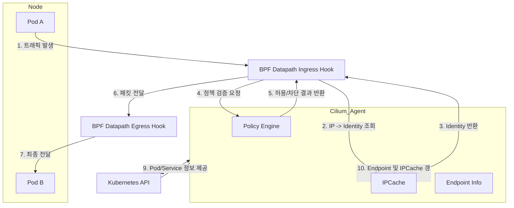

## 🧠 구성요소
- **Cilium Agent**: 정책 처리, ipcache 관리, eBPF 프로그램 삽입
- **BPF Datapath**: 패킷 필터링, NAT, Load Balancing 등
- **IPCache**: IP → Identity 매핑 저장
- **Endpoint (Pod)**: Cilium이 관리하는 실제 네트워크 단위
- **Kubernetes API**: 메타데이터 제공

## 플로우 다이어그램

1. Pod A에서 트래픽 발생
2. BPF Ingress Hook에서 트래픽 감지
3. IPCache를 조회해 IP → Identity 확인(Security ID)
4. Endpoint metadata도 확인
5. Policy Engine에서 허용/차단 판단
6. (동기화) Kubernetes API에서 메타데이터 가져오기
7. (동기화) Endpoint/Policy/IPCache 업데이트
8. Egress Hook을 통해 다음 목적지로 전달
9. Pod B에서 트래픽 수신