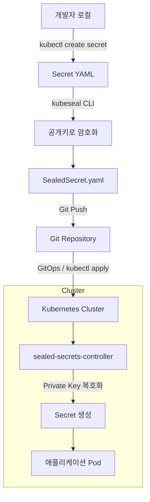
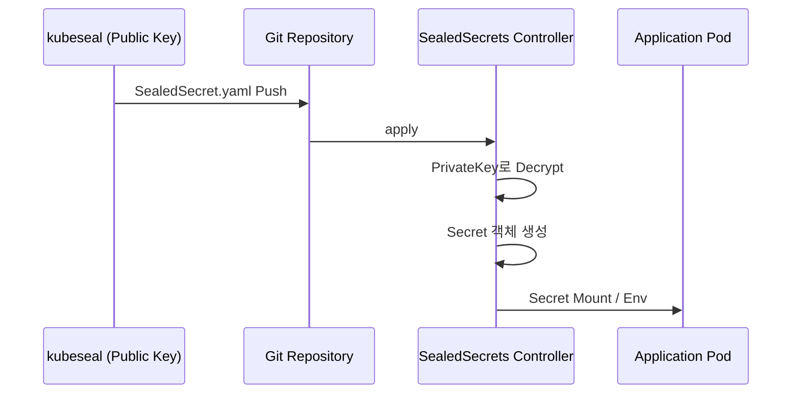

민감한 값은 Git에 평문 `Secret`으로 올리지 않고, **클러스터 공개키로 암호화한 SealedSecret**만 올린 뒤, 클러스터 안 **sealed-secrets 컨트롤러**가 개인키로 복호화해 일반 `Secret`을 만들어 주는 패턴입니다. ([Bitnami Sealed Secrets](https://github.com/bitnami-labs/sealed-secrets))

---

### 흐름 (개요)

---

### 시퀀스 (암호화·마운트)

---

### 참고

- [sealed-secrets (GitHub)](https://github.com/bitnami-labs/sealed-secrets)
- 클러스터마다 **SealedSecret은 해당 클러스터에서만** 복호화되도록 키가 묶이므로, 환경(dev/stage/prod)별로 별도 seal이 필요합니다.
