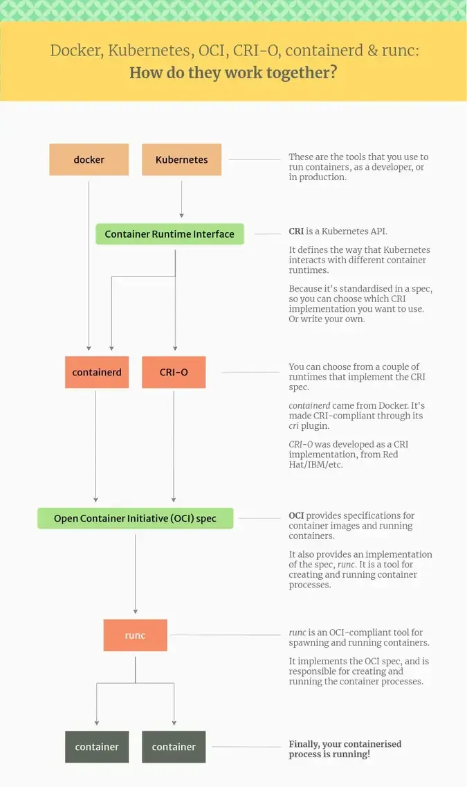
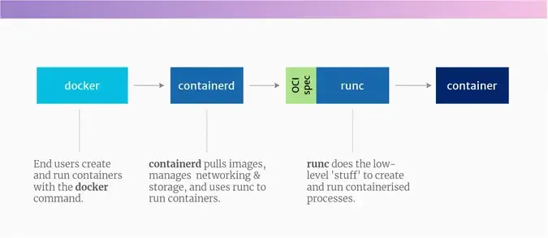
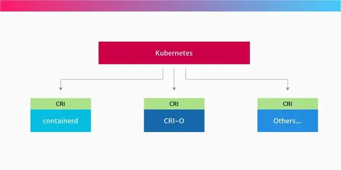

# Docker - containerd, CRI-O 및 runc 차이

- **Open Container Initiative (OCI)**
  컨테이너 명세(이미지 포맷, 런타임, 배포)
- **Container Runtime Interface (CRI)** in Kubernetes
  쿠버네티스에서 다른 컨테이너 런타임들을 사용할 수 있는 API

## Docker stack 작업
Docker를 이용하여 명령하면 Docker daemon을 통해 containerd를 호출하여 runc로 컨테이너를 실행한다.

### Docker stack의 하위 레벨 도구 (low -> high 순)
- **runc**: runc는 *low-level* 컨테이너 런타임. 이것은 Linux의 네이티브 기능을 이용하며 OCI를 준수하여 컨테이너를 실행. 컨테이너 생성에 필요한 Go 라이브러리인 `libcontainer`를 포함한다.
- **containerd**: containerd는 low-level 위의 *high-level* 컨테이너 런타임. 이미지, 스토리지, 네트워킹에 대한 전송 기능. OCI 스펙 지원
- **docker daemon**: dockerd는 표준 API를 제공하고 컨테이너 런타임과 통신하는 데몬 프로세스(백그라운드 장기 실행 프로세스)
- **docker CLI tool**: docker-cli는 `docker ...` 명령어로 docker daemon과 상호작용함. 이건 lower level에 대한 이해가 없이도 container를 컨트롤 할 수 있게 해줌

### Kubernetes가 Docker를 사용했나?
원래는 그랬다.
하지만 쿠버네티스는 시간이 지남에 따라 **컨테이너에 독립적인 플랫폼**으로 발전했음.
쿠버네티스에서는 Container Runtime Interface (CRI) API를 개발했으며, 이를 통해 다양한 컨테이너 런타임을 플러그인 할 수 있었음.

Docker는 kubernetes보다 오래된 프로젝트이며 CRI를 구현하지 않는다. 그래서 Kubernetes에서 Docker의 프로젝트 전환을 돕고자 dockershim을 개발하였다.

#### shim 또한 죽음
Kubernetes 1.24버전부터는 dockershim 구성요소에서 완전히 제거됐으므로 더이상 Docker를 컨테이너 런타임으로 지원하지 않는다.

Kubernetes에서는 Docker의 논리적 후속 모델을 containerd로 한다. 아니면 CRI-O로도 대체 가능함.

:::tip 핵심 인사이트

**Docker는 CRI를 따르지 않아서, Kubernetes가 직접 다룰 수 없었고, 그 사이를 dockershim이라는 어댑터가 억지로 중계해줬다.**  
하지만 내부적으로는 결국 Docker도 containerd → runc를 사용하니 **굳이 Docker를 끼고 쓸 이유가 없어져서 dockershim과 함께 제거된 것.**

:::

### OCI 사양
OCI는 컨테이너 세상에서 표준화를 위한 첫번째 노력이다.
이는 2015년에 Docker를 비롯한 여러 단체에 의해 설립됨.

**OCI는 여러 테크 기업들의 지원을 받고 있으며 컨테이너 이미지 형식과 실행 방법에 대한 사양을 유지관리 하고 있다.**

예를 들어, 리눅스 호스트에는 하나의 OCI 호환 런타임을 사용하고 윈도우 호스트에는 다른 런타임을 사용할 수 있다.

### Kubernetes CRI
Kubernetes 프로젝트에서 만든 API.

**CRI는 Kubernetes에서 컨테이너를 생성하고 관리하는 다양한 런타임들에 대한 제어를 위해 사용되는 인터페이스이다.**

### low-level 런타임
OCI 사양은 다른 도구들의 기능을 다른 방식으로 구현하도록 허용한다.

- **crun**: C로 개발. (runc는 Go)
- **firecracker-containerd** from AWS: 개인 경량 VM에 대한 OCI 사양을 구현함.
- **gVisor** from Google: 자체 커널을 가진 컨테이너를 생성. `runsc` 런타임에 OCI 사양을 구현함.
