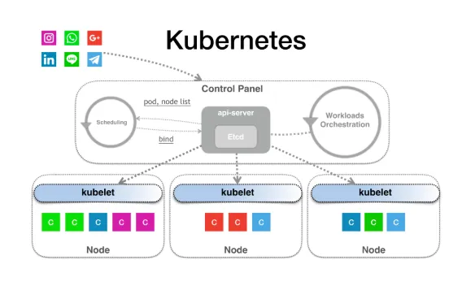
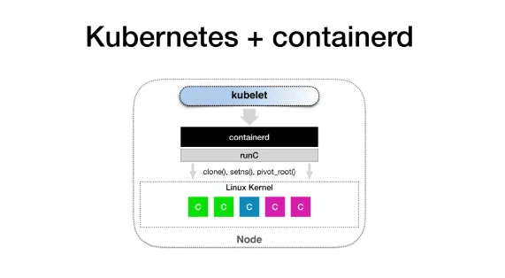
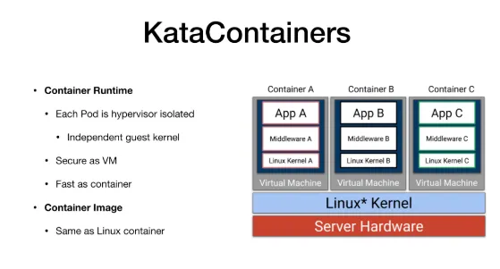
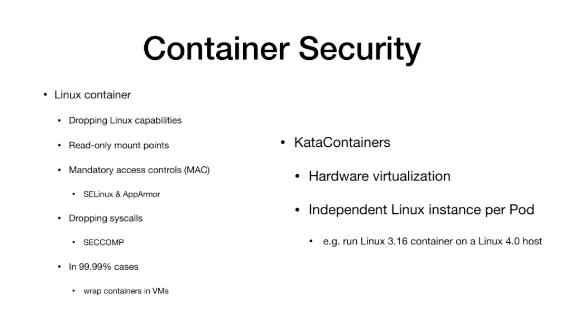
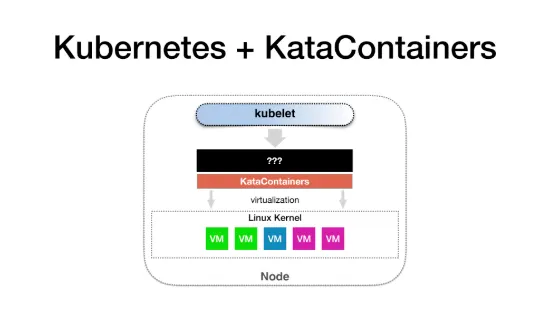
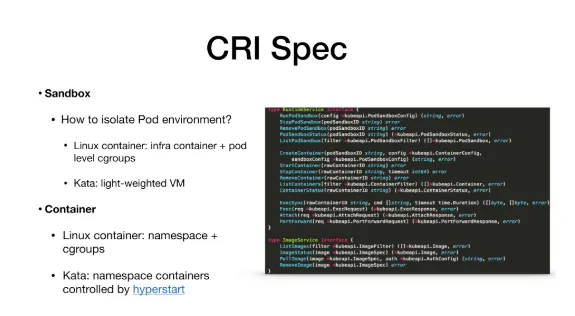
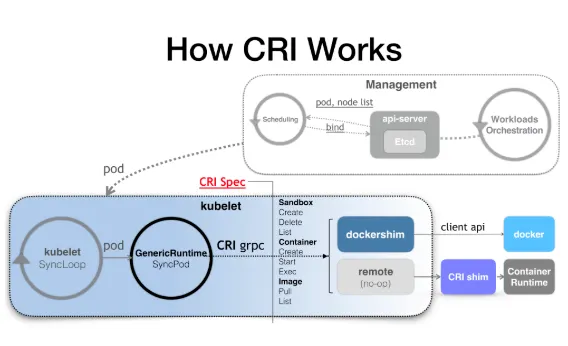

# 쿠버네티스 작동 방식 정리

## 쿠버네티스의 작동 방식

쿠버네티스에 워크로드, 즉 애플리케이션을 제출하면 API 서버는 먼저 애플리케이션을 API 객체로 etcd에 저장한다.
쿠버네티스에서는 `controller-manager`가 오케스트레이션을 담당하고, 여러 컨트롤러가 제어 주기를 통해 실행됨.
제어 주기는 오케스트레이션을 수행하는 데 사용되며, 애플리케이션에 필요한 Pod를 생성하는 데 도움을 준다.

Pod가 생성되면 `kube-scheduler`는 새 Pod의 변경 사항을 감시(watch)한다.
만약 새 Pod를 찾으면 모든 스케쥴링 알고리즘을 실행하고 결과로 나온 노드 이름을 Pod 객체의 `NodeName` 필드에 쓴다. 이를 `바인딩 작업`이라고 한다.
그 다음 바인딩 작업 결과를 etcd에 저장한다.
이후 Pod 중 하나가 노드에 바운드 되는데 이를 `스케쥴링`이라 부른다.

Kubelet은 모든 노드에서 실행된다.
Kubelet은 모든 Pod 객체의 변경 사항을 감시(watch)한다.
Pod가 노드에 바인딩되어 있고 바인딩된 노드가 자기 자신임을 확인하면 Kubelet이 자신의 노드의 `containerd` 프로세스를 호출하여 해당 Pod에 있는 모든 컨테이너를 실행한다.

이 때, containerd는 애플리케이션에 필요한 컨테이너를 실행하기 위해 `runc`를 호출하여 `namespace`, `cgroups` 및 `chroot`(컨테이너 프로세스의 root 경로를 변경)를 설정한다.

이것이 쿠버네티스 전체 작동 원리이다.

## Linux Container

리눅스 컨테이너는 컨테이너 런타임과 컨테이너 이미지로 나눌 수 있음.

런타임 부분은 실행 중인 프로세스의 동적인 관점이자 리소스 경계이므로 네임스페이스와 cgroups에 의해 자동으로 생성된다.

이미지는 실행하려는 프로그램의 정적 관점으로 볼 수 있으며 실제로는 프로그램 + 데이터 + 모든 종속성 + 모든 디렉터리 파일의 압축된 패키지이다.
이러한 압축 패키지가 유니온 마운트 방식으로 함께 마운트 될 때 `rootfs`라 부른다.
`rootfs`는 전체 프로세스를 정적으로 보는 관점이다.

## Kata Container

컨테이너 런타임은 가상 머신처럼 하드웨어 가상화를 사용하는 하이퍼바이저에 의해 구현된다.
KataContainer와 같은 각 Pod는 완전한 Linux 커널을 갖춘 경량 가상 머신이다.
KataContainer는 VM처럼 강력한 격리 기능을 제공할 뿐만 아니라, 최적화 및 성능 설계 덕분에 컨테이너 항목과 유사한 민첩성을 제공한다.
이미지 측면에서 KataContainer는 Docker와 크게 다르지 않다. 표준 Linux 컨테이너를 사용하고 표준 OCI 준수 이미지를 지원하므로 이 부분은 완전히 동일하다.

## 컨테이너 보안

KataContainer를 사용하는 이유 중 하나는 보안이다.
많은 금융, 암호화, 여러 블록체인이 존재하는 시나리오에서는 안전한 컨테이너 런타임이 필수다.

만약 Docker를 사용 중이라면 여러가지 보안 적용 방법이 있다.
예를 들면,

1. 런타임에서 할 수 있는 작업과 할 수 없는 작업을 지정할 수 있음.
2. 읽기 전용 마운트 지점으로 이동할 수 있음.
3. SELinux나 AppArmor를 사용하여 컨테이너를 보호할 수 있음.
4. SECCOMP를 사용하여 일부 시스템 호출을 직접 삭제할 수 있음.

하지만 이런 작업들은 컨테이너와 호스트 사이에 새로운 계층을 생성한다. 이 계층은 시스템 호출을 필터링하고 가로채기 때문이다. 계층이 구축될수록 컨테이너 성능이 저하된다.

더 중요한 것은 이런 작업을 수행하기 전에 정확히 무엇을 해야하고 어떤 시스템 호출을 삭제해야 하는지 파악해야 한다는 것이다. 이 부분을 제대로 아는 사람은 거의 없다.

KataContainer는 가상 머신과 동일한 하드웨어 가상화를 사용하며 독립적인 커널을 갖는다. 그러므로 KataContainer가 제공하는 격리는 VM을 신뢰하는 것처럼 완벽하게 신뢰할 수 있다.

더 중요한 것은 각 Pod에 작은 가상머신처럼 독립 커널이 있으므로 호스트에서 실행되는 커널 버전과 컨테이너 커널 버전이 달라도 된다.

## 쿠버네티스 + 보안 컨테이너

Kubelet은 마치 containerd를 호출하는 것처럼 KataContainer를 호출하는 방법을 찾아야 하며, KataContainer는 하이퍼바이저를 설정하여 이 작은 VM을 실행하게 해준다.

## 컨테이너 런타임 인터페이스(CRI)

CRI는 쿠버네티스를 위해 컨테이너가 어떤 작업을 수행해야 하고 각 작업이 어떤 매개변수를 가져야 하는지 설명하는 것이다. 하지만 CRI는 Pod라는 개념이 없는 Containerd 중심의 API라는 점에 유의해야 한다.
왜냐하면 Docker와 같은 프로젝트가 Pod에 대한 정보와 Pod API를 노출하는 것을 원치 않기 때문이다.

또 다른 이유는 유지 관리이다. Pod 개념이 CRI에 이미 존재한다면, Pod 기능에 대한 후속 변경은 CRI에도 영향을 미칠 수 있다. 인터페이스의 경우 유지 관리 비용이 상대적으로 높다. 따라서 CRI는 컨테이너 조작을 위한 몇 가지 공통 인터페이스를 명시하고 있음을 알 수 있다.

여기서 CRI는 컨테이너와 샌드박스로 대략 분류할 수 있다. 샌드박스는 Pod를 구현하는 메커니즘을 설명하는데 사용되므로 실제 컨테이너와 관련된 필드이다. Docker 또는 Linux 컨테이너의 경우, "인프라 컨테이너"라는 이름의 컨테이너가 매칭 후 마지막으로 실행된다. 컨테이너는 매우 작은 컨테이너로, 전체 Pod의 노드와 네임스페이스를 보관하는데 사용한다.

하지만 쿠버네티스가 Docker와 같은 컨테이너 런타임을 사용할 경우, Pod 레벨의 cgroup을 제외하고는 Pod 레벨의 격리를 제공하지 않는다.

다음 단계(컨테이너 API)에서 Docker는 호스트 머신에서 사용자 컨테이너를 시작하지만, Kata는 그렇지 않다. Kata는 새 컨테이너를 하나씩 시작하는 대신, Pod에 해당하는 경량 가상 머신, 즉 앞서 생성한 샌드박스에 사용자 컨테이너에 필요한 네임스페이스를 설정한다. 따라서 이 메커니즘을 사용하면 제어판이 작업을 완료하고 Pod가 예약되었음을 나타낸다. Kubelet은 Pod를 시작하거나 생성하고, 마지막으로 CRI를 호출한다.

따라서 이 단계에서 Docker를 사용하는 경우 `Dockershim`이 CRI 요청에 응답한다. 하지만 Docker를 사용하지 않는 경우, `Remote`라는 모드를 실행해야 한다.
즉 이 CRI 요청을 정상 처리하기 위해 CRI shim을 작성해야 한다.

## CRI Shim은 어떻게 작동하는가?

`CRI Shim`은 CRI 요청을 런타임 API로 변환할 수 있다.
예를 들어, Pod에 컨테이너 A와 B가 있고, 이를 쿠버네티스에 제출하면 쿠버네티스에서 시작되는 CRI 코드는 다음과 같은 순서이다.

1. 샌드박스 foo를 실행
   - Docker: 인프라 컨테이너인 foo라는 작은 컨테이너를 실행
   - Kata: foo라는 가상머신을 시작
2. 컨테이너 A와 B를 생성하고 시작
   - Docker: 두 개의 컨테이너가 시작됨
   - Kata: 두 개의 작은 네임스페이스가 작은 가상머신인 Sandbox에서 시작됨
