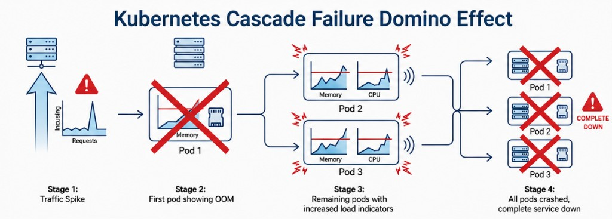

# [Ch-01] Kubernetes 왜 필요한가? 결국 Linux까지 내려가야 이해된다!

> 영상: [플레이 빌더 — Ch-01 (YouTube)](https://youtu.be/OjoUal1JPcM?si=KjPzU7GeDOPkcLyM)  
> 실습 저장소: [play-builder/kubeadm-cluster](https://github.com/play-builder/kubeadm-cluster)

## 1. 왜 강의가 리눅스(펭귄)에서 시작하는가

컨테이너와 오케스트레이션의 근원은 **리눅스 커널**에 있다. 따라서 학습 경로는 **Linux → Container → Kubernetes**로 이어지며, 쿠버네티스만 겉돌면 장애 시 “왜 그런지”까지 내려가기 어렵다는 메시지로 시작한다.

:::tip
- **리눅스 커널**: 하드웨어와 애플리케이션 사이에서 CPU·메모리·디스크·네트워크 등을 관리하는 OS의 핵심 부분. “펭귄”은 리눅스 마스코트/로고를 가리키는 말이다.
- **컨테이너**: 앱과 실행에 필요한 파일을 묶어, 한 서버 안에서도 다른 프로세스와 겹치지 않게 돌리는 실행 단위(내부적으로는 커널 기능으로 격리된 프로세스).
- **오케스트레이션(Orchestration)**: 여러 컨테이너의 배치, 재시작, 네트워크, 설정을 자동으로 맞춰 주는 “지휘” 역할. 쿠버네티스가 대표적이다.
:::

---

## 2. 인프라가 바뀌어도 목적은 같다

물리 서버 → VM → 컨테이너로 **형태**는 달라졌지만, 인프라의 궁극적 목적은 변하지 않았다.

- **안정적인 서비스 제공** = 서비스가 죽지 않게 관리하는 것.

이 강의 전체를 한 줄로 요약하면 <strong>“서비스를 어떻게 죽지 않게 관리할 것인가”</strong>에 대한 이야기라고 해도 된다.

---

## 3. 왜 쿠버네티스(K8s)가 필요해졌는가

과거에는 서버 몇 대를 사람이 직접 배포·모니터링해도 운영이 가능했다. 지금은 <strong>MSA(마이크로서비스 아키텍처)</strong>로 하나의 큰 서비스가 수백~수천 개의 작은 컨테이너로 쪼개지고 서로 얽혀 돌아간다.

- 수천 개 컨테이너를 사람이 일일이 배포·모니터링·장애 시 직접 복구하는 것은 **사실상 불가능**에 가깝다.
- 그래서 이 복잡한 관리를 자동화하는 솔루션이 **쿠버네티스**다.

:::tip
- **MSA(Microservices Architecture)**: 큰 애플리케이션을 작은 서비스(팀·배포 단위)로 나누는 설계. 서비스마다 컨테이너/파드가 늘어나 관리 난이도가 급증한다.
- **쿠버네티스(Kubernetes, 줄여 K8s)**: 컨테이너를 여러 대 서버(노드)에 올리고, 장애 시 재기동·스케일링 등을 자동화하는 오케스트레이션 플랫폼.
:::

### 3.1 쿠버네티스가 강조하는 두 가지 가치

1. **고가용성(High Availability)**  
   서버 일부가 죽어도 전체 서비스는 살아 있게 만드는 힘.

2. **자가 치유(Self-healing)**  
   장애가 나면 시스템이 스스로 복구하는 능력.

**SPOF(Single Point of Failure, 단일 장애점)** 이 있으면 서버 한 대가 죽을 때 서비스 전체가 다운된다. 서버 A·B·C처럼 여러 대로 나누면 한 대가 죽어도 나머지가 요청을 처리해 사용자가 장애를 못 느낄 수 있다. 쿠버네티스는 설계 단계에서 **단일 장애점을 없애는 방향**을 강하게 밀어붙인다.

**자가 치유**의 원리는 단순하다.

- **선언**: 엔지니어가 “파드를 항상 N개 유지해 줘”처럼 **원하는 상태**를 선언한다.
- **감지**: 컨트롤러가 기대 상태와 현재 상태의 차이를 본다.
- **조치**: 파드가 줄면 즉시 새 파드를 만들어 다시 N개로 맞춘다.

예전에는 새벽에 서버가 죽으면 사람이 알람에 깨서 수동 대응했지만, K8s는 **먼저 시스템이 복구**하고 운영자는 다음날 **원인 분석**에 집중할 수 있다. 운영의 패러다임이 바뀐다는 설명이다.

:::tip
- **고가용성(HA)**: 일부 구성요소가 실패해도 서비스가 계속 제공되도록 설계하는 것.
- **자가 치유(Self-healing)**: 설정해 둔 “정상 상태”에서 벗어나면 컨트롤러가 파드 재생성 등으로 되돌리는 동작.
- **SPOF(Single Point of Failure)**: 그 한 지점만 망가져도 전체가 멈추는 구조적 약점.
- **파드(Pod)**: 쿠버네티스에서 컨테이너를 감싸는 최소 배포 단위. 보통 1개 이상의 컨테이너가 함께 묶인다.
- **선언적(Declarative) 설정**: “지금 이렇게 되어 있어라”를 YAML 등으로 적어 두면, 시스템이 현재 상태를 그에 맞추는 방식.
- **컨트롤러(Controller)**: 디플로이먼트 등 리소스의 **현재 상태**와 **원하는 상태**를 비교해 차이를 메우는 쿠버네티스 내부 로직.
:::

---

## 4. 연쇄 장애(Cascade Failure)와 방어 장치

실제 운영은 가혹하다. 예시 시나리오:

- 새벽 3시 **PagerDuty** 등으로 알람 → **에러율 급증**, **503 Service Unavailable** 반복.
- 이는 “컨테이너 몇 개 죽은 수준”이 아니라 **서비스 전체 마비**에 가깝다.
- 클러스터 지표가 평소와 다른 **기형적 패턴**으로 번지면 **연쇄 장애**다.

연쇄 장애의 흐름(강의에서 든 도미노 비유):

1. 트래픽 **스파이크**
2. 파드 1이 **메모리 초과(OOM)** 로 강제 종료
3. 남은 파드 2·3에 부하가 몰림
4. 2·3도 임계점을 넘어 연쇄 종료
5. 전 파드가 줄줄이 죽으며 **서비스 전체 다운**

트래픽 급증 → 한 파드 OOM → 부하 전가 → 나머지도 한계 초과라는 **도미노**가 한눈에 보인다.

그래서 **requests/limits** 같은 리소스 선언과 함께, 트래픽·회복력 설계가 없으면 “한 방에 전부 쓰러지는” 패턴이 재현된다는 점을 염두에 두어야 한다.

이를 막으려면 **방어 장치(Defense mechanism)** 가 필요하다.

- **Rate limiting**: 들어오는 요청 속도를 제한해 시스템이 감당 가능한 만큼만 받게 한다.
- **Circuit breaker**: 특정 지점 장애 시 연결을 끊어 다른 곳으로 장애가 번지지 않게 **격리**한다.

로그에서 메모리 문제로 죽었다면 **OOMKilled**, 종료 코드 **137**이 전형적이다.

:::tip
- **PagerDuty**: 장애·알람을 담당자에게 돌려 주는 온콜/인시던트 관리 서비스(예시로 등장).
- **연쇄 장애(Cascade failure)**: 한 곳의 문제가 연쇄적으로 퍼져 시스템 전체가 무너지는 현상.
- **스파이크(Spike)**: 트래픽이 짧은 시간에 급증하는 것.
- **OOM(Out Of Memory)**: 메모리가 부족해져 커널이 프로세스를 죽이거나, cgroup 한도를 넘긴 경우 컨테이너가 종료되는 상황.
- **OOMKilled**: 쿠버네티스/컨테이너 런타임이 보여 주는 “메모리 때문에 강제 종료됨” 상태 표시.
- **Rate limiting(속도 제한)**: 초당 요청 수 등을 제한해 과부하를 막는 기법.
- **Circuit breaker(서킷 브레이커)**: 하위 시스템이 불안정할 때 호출을 잠시 끊어 상위로 장애가 퍼지지 않게 하는 패턴.
- **종료 코드(exit code)**: 프로세스가 끝날 때 부모에게 넘기는 숫자. 137은 아래 OOM 절에서 설명.
:::

---

## 5. 실습 환경: Terraform + kubeadm 클러스터

- **Terraform**으로 인프라를 코드(**IaC**)로 정의해 **한 번에** 클러스터를 만든다.
- 레포 **kubeadm-cluster**를 클론하고, `terraform.tfvars` 예시를 복사한 뒤 **본인 IP(`my_ip`)** 등을 수정한다.
- `terraform init` → `terraform plan` → `terraform apply -auto-approve`로 AWS에 리소스 생성 (비용 발생 가능).
- 아키텍처: **컨트롤 플레인 1대**(예: t3.medium), **워커 2대**(예: t3.small) 등.
- SSH 대신 **SSM 세션**으로 접속하는 흐름이 안내된다.
- 컨트롤 플레인에서 **kubeadm** 부트스트랩 로그(`tail -f` 등)로 **Calico** 등 설치 완료를 확인하고, `kubectl get pods -n tigera-operator` / `calico-system` 등으로 상태 확인.
- 홈에 생성되는 **조인 스크립트**를 워커에서 `sudo`로 실행해 조인한다.
- 편의를 위해 `kubectl` 대신 **`k` 별칭**을 쓰는 예시도 나온다.

:::tip
- **Terraform**: 클라우드 서버·네트워크 등 인프라를 코드로 정의하고 생성/변경/삭제하는 도구.
- **IaC(Infrastructure as Code)**: 서버를 손으로 클릭해서 만드는 대신, 파일로 인프라를 적어 자동화하는 방식.
- **kubeadm**: 쿠버네티스 클러스터를 표준 방식으로 설치·업그레이드할 때 쓰는 공식 도구.
- **컨트롤 플레인(Control plane)**: API 서버, 스케줄러, 컨트롤러 등 클러스터 “두뇌” 노드.
- **워커 노드(Worker node)**: 실제 워크로드(파드)가 돌아가는 서버.
- **인스턴스 타입(t3.medium 등)**: 클라우드 VM의 CPU·메모리 사양 이름.
- **SSM(AWS Systems Manager Session Manager)**: SSH 키 없이 브라우저/CLI로 서버 셸에 붙는 AWS 접속 방식.
- **조인(Join)**: 워커 노드를 클러스터에 합류시키는 작업.
- **Calico**: 쿠버네티스에서 파드 네트워크(라우팅·정책)를 담당하는 CNI 플러그인 중 하나.
- **별칭(alias)**: `k` 한 글자로 `kubectl` 전체를 치환해 편하게 쓰는 셸 설정.
:::

---

## 6. OOMKilled 실습: YAML이 말하는 것과 실제로 죽이는 주체

실습 파드는 대략 다음과 같은 구조다.

- `resources.limits.memory` 등으로 **메모리 상한**(예: 128Mi)을 둔다.
- **stress** 등으로 그보다 큰 메모리 사용을 강제해 **한도 초과**를 만든다.

배포 후 파드는 **CrashLoopBackOff**, 상태에 **OOMKilled**가 보인다.

### 6.1 CrashLoopBackOff가 의미하는 것

1. 프로세스가 메모리 초과 등으로 **죽음**
2. **kubelet**은 왜 죽었는지 모르므로 **재시작**을 시도 (`restartPolicy` 기본 `Always`)
3. 같은 이유로 또 죽음 → 재시작 간격이 **지수 백오프**(10초, 20초, 40초 … 최대 약 5분)로 늘어남
4. 무의미한 재시작 낭비를 막기 위해 **루프**에 빠진 것처럼 보이는 상태가 **CrashLoopBackOff**

원인 확인은 `kubectl describe pod` 등으로 **마지막 상태**를 보며, `OOMKilled`와 **exit code 137**을 확인한다.

### 6.2 137의 의미

- **128 이상**이면 프로세스가 스스로 정상 종료한 것이 아니라 **시그널에 의한 강제 종료** 쪽을 의미한다.
- **137 = 128 + 9** → **SIGKILL(9)**.

중요한 오해 바로잡기:

- **쿠버네티스가 직접 SIGKILL을 보내는 것이 아니다.**
- K8s/**kubelet**은 **한도를 넘었다는 정보를 커널 쪽 cgroup에 반영**하는 역할에 가깝고, **실제 메모리 통제와 킬은 리눅스 커널**이 수행한다.

### 6.3 메모리 한도가 커널까지 가는 경로(강의 요약)

대략 **kubelet → containerd → runc → cgroup(v2)에 한도 기록 → 커널이 사용량 감시 → 한도 초과 시 OOM Killer 발동 → SIGKILL** 흐름으로 설명한다. 쿠버네티스는 그 결과를 사용자에게 **“OOMKilled”라는 텍스트**로 보여 줄 뿐이다.

워커 노드에서 **`dmesg`** 등으로 **커널 메시지**를 보면 `Memory cgroup out of memory` 같은 로그와 **PID**, **oom_score_adj** 관련 수치 등을 볼 수 있다.

### 6.4 cgroup OOM vs 시스템 전체 OOM

- **cgroup OOM**: 해당 파드(그룹)가 **자기 한도**를 넘겨 **그 워크로드만** 희생 → 노드 전체에는 당장 큰 영향이 없을 수 있음.
- **시스템 OOM**: 노드 메모리 **고갈** → 훨씬 위험. 커널은 **oom_score_adj** 등 **종료 우선순위**를 보고 어떤 파드를 먼저 희생할지 결정한다.

:::tip
- **YAML / 매니페스트(Manifest)**: 파드·CPU·메모리 한도 등을 적어 `kubectl apply`로 클러스터에 “원하는 상태”를 제출하는 파일.
- **`resources.limits`**: 이 컨테이너가 넘지 말아야 할 자원 상한. 메모리 limit은 cgroup에 반영된다.
- **stress**: CPU·메모리 부하를 인위적으로 걸어 테스트하는 도구.
- **MiB(Mebibyte)**: 1024 기반 메모리 단위(운영/커널 문맥에서 자주 씀).
- **CrashLoopBackOff**: 컨테이너가 반복적으로 죽고, 재시작 간격이 점점 늘어나며 루프에 빠진 상태.
- **kubelet**: 각 노드에서 파드를 실제로 띄우고, 헬스체크·재시작을 담당하는 에이전트.
- **`restartPolicy`**: 파드 안 컨테이너가 종료됐을 때 다시 띄울지 정하는 정책. `Always`면 계속 재시작 시도.
- **지수 백오프(exponential backoff)**: 실패할 때마다 재시도 간격을 2배씩 늘려 시스템 부담을 줄이는 방식.
- **`kubectl describe`**: 리소스의 이벤트·마지막 상태·실패 이유 등을 사람이 읽기 좋게 보여 주는 명령.
- **시그널(Signal)**: 리눅스가 프로세스에게 보내는 제어 신호. `kill` 명령도 시그널을 보낸다.
- **SIGKILL(시그널 9)**: 정리 작업 없이 즉시 프로세스를 끝내는 강제 종료. 무시할 수 없다.
- **containerd**: 컨테이너 실행을 담당하는 런타임(이미지 pull, 컨테이너 생명주기 관리).
- **runc**: 실제로 컨테이너 프로세스를 만들고 cgroup·namespace를 적용하는 저수준 실행 도구.
- **cgroup(control group)**: CPU·메모리 등 사용량을 그룹별로 제한·측정하는 커널 기능.
- **OOM Killer**: 메모리가 부족할 때 어떤 프로세스를 희생할지 고르고 `SIGKILL`을 보내는 커널 메커니즘.
- **`dmesg`**: 커널이 출력한 최근 로그(부팅·OOM 등)를 보는 명령.
- **PID(Process ID)**: 프로세스마다 붙는 고유 번호.
- **oom_score_adj**: OOM 때 “먼저 희생될지”에 영향을 주는 조정값(높을수록 희생되기 쉬운 쪽으로 해석되는 맥락이 일반적이다).
:::

---

## 7. CPU Throttling 실습: 로그는 조용한데 느려지는 경우

실무에서 흔한 유형:

- 노드 CPU는 넉넉해 보이는데 **특정 서비스만** 응답이 이상하게 느리다.
- 애플리케이션 로그에는 **에러가 없다**.

이때 대표 원인 중 하나가 **CPU Throttling**이다. OOM과 달리 파드가 죽지 않아 **단서가 적다**고 한다.

예시 매니페스트 아이디어:

- stress에 **CPU 1코어(1000m)** 를 쓰라고 시키지만
- 파드의 **CPU limit**은 **50m**(1코어의 5%)만 허용

즉 프로세스는 1000m를 쓰려 하지만, 컨테이너에게 허용된 상한은 50m뿐이다.

### 7.1 커널 쪽 메커니즘: CFS와 대역폭 제한

- K8s의 **밀리코어(millicore)** 단위는 결국 커널의 **CFS(Completely Fair Scheduler)** 계열 스케줄링과 연결된다.
- kubelet이 limit을 **cgroup의 CPU 설정**에 기록하면 커널이 이를 반영한다.
- **CFS 자체**는 “공정한 스케줄링”에 가깝고, **CPU 사용 상한을 강제로 자르는** 쪽은 **CFS bandwidth controller**가 담당한다고 정리한다.
- 기본 **주기(period)** 는 **100ms**로 설명되며, 이 주기 안에서 쓸 수 있는 **쿼터(quota)** 가 정해진다.
- limit이 50m면 100ms 중 **약 5ms만** CPU를 쓸 수 있고, 나머지는 **강제 대기** → 이것이 **throttling**이다.

### 7.2 `kubectl top`이 오해를 부를 수 있는 이유

`kubectl top`으로 보면 CPU가 **50m 근처**로 “정상”처럼 보일 수 있다. 하지만 그것은 **천장(한도)에 맞춘 평균/표면 값**에 가깝고, **스로틀 빈도**는 잘 드러나지 않는다는 **비유**가 나온다.

정확히 보려면 **커널 레벨 데이터**가 필요하다.

### 7.3 워커에서의 확인 절차(강의 흐름)

1. 파드가 돌아가는 **노드** 확인 (`kubectl get pod -o wide` 등).
2. 워커에서 **`crictl`** 로 컨테이너 ID 확인.
3. **컨테이너 안 PID 1**과 **호스트에서 보는 PID**가 다름 → **PID namespace** 격리 설명.
4. **`/proc/<host_pid>/cgroup`** 등으로 **cgroup 경로** 추출 (**Burstable** 등 **QoS** 언급).
5. cgroup v2의 **`cpu.max`** 등에서 **quota/period**가 설정과 일치하는지 확인.
6. **`cpu.stat`** 에서 `nr_periods`, `nr_throttled` 등으로 **스로틀이 난 비율**을 계산.
7. `usage_usec`, `throttled_usec` 등으로 실제 CPU 사용 시간 vs 강제 정지 시간을 비교.

:::tip
- **CPU Throttling**: CPU 사용 한도(quota)를 다 쓰면, 다음 주기가 올 때까지 실행을 막혀 기다리는 상태. 느려지지만 에러는 없을 수 있다.
- **밀리코어(m, millicore)**: 쿠버네티스에서 CPU를 1코어=1000m처럼 나누어 표현하는 단위.
- **CFS(Completely Fair Scheduler)**: 리눅스가 여러 프로세스에 CPU 시간을 비교적 공정하게 나누는 스케줄러 계열.
- **CFS bandwidth controller**: cgroup에 설정된 **quota/period**로 “이 주기 안에 CPU를 이것만 써라”를 강제하는 기능.
- **주기(period) / 쿼터(quota)**: 예를 들어 0.1초(period) 동안 쓸 수 있는 CPU 시간 상한(quota)을 정해 throttling을 구현한다.
- **`kubectl top`**: 노드/파드의 CPU·메모리 사용량을 보여 주지만, 샘플링·평균 때문에 스로틀의 “고통”이 가려질 수 있다.
- **`crictl`**: containerd/CRI-O 등 CRI 런타임에 붙어 컨테이너 목록·상태를 보는 CLI.
- **PID namespace**: 컨테이너 안에서는 PID가 1부터 다시 시작하는 것처럼 보이게 격리하는 커널 기능.
- **`/proc`**: 커널이 프로세스 정보를 파일처럼 노출하는 가상 파일시스템.
- **QoS Class(Burstable 등)**: 요청(requests)과 한도(limits) 조합에 따라 파드에 붙는 품질 등급. 스케줄링·퇴출(eviction) 우선순위에 영향을 줄 수 있다.
- **cgroup v2**: cgroup의 두 번째 세대. `cpu.max`, `cpu.stat` 같은 파일로 제한·통계를 본다.
- **`cpu.max`**: cgroup v2에서 “quota period” 형태로 CPU 상한을 적는 파일.
- **`cpu.stat`**: throttling 횟수·시간 등 CPU 관련 통계를 담는 cgroup v2 파일.
:::

### 7.4 현업에서는

노드에 들어가 cgroup을 일일이 보기는 번거로우므로, **Prometheus**, **Datadog** 등이 **cAdvisor** 등을 통해 <strong>커널의 원천 지표를 주기적으로 긁어 온다고 한다</strong>.

:::tip
- **Prometheus**: 메트릭을 수집·저장하고 알람·조회에 쓰는 모니터링 시스템(생태계가 큼).
- **Datadog**: SaaS 형태의 모니터링/APM 서비스.
- **cAdvisor**: 노드에서 컨테이너 자원 사용량을 수집하는 도구. kubelet과 함께 언급되는 경우가 많다.
:::

---

## 8. 한 줄 명제: K8s는 지휘자, 커널은 집행자

- 쿠버네티스를 **편한 배포 도구**로만 보면 안 된다.
- **K8s는 지휘자**, **커널은 집행자** — 자원 통제의 **최종 집행권은 커널**에 있다.

:::tip
- **집행(Enforcement)**: “한도를 넘기면 멈춰라/죽여라”를 실제로 적용하는 주체. 쿠버네티스는 설정을 반영하고, 커널이 물리적으로 실행한다.
:::

---

## 9. 커널이 제공하는 핵심 “원시 기능”

1. **Namespaces** — 격리.
2. **cgroups** — 자원 한도.
3. **Overlay FS** — 이미지 레이어.
4. **veth** — 파드 네트워크.

:::tip
- **Namespaces(네임스페이스)**: 마운트, 네트워크, PID 등 “보이는 세계”를 프로세스마다 나누는 커널 격리 기술.
- **Overlay FS(overlay 파일시스템)**: 여러 디렉터리(레이어)를 겹쳐 하나의 파일 트리처럼 보이게 하는 방식. 컨테이너 이미지에 흔히 사용된다.
- **veth(virtual ethernet pair)**: 한 쌍으로 붙는 가상 네트워크 인터페이스. 컨테이너↔호스트 브리지 연결에 쓰인다.
:::

---

## 10. 인프라 진화사: Physical → VM → Container

(앞 절의 물리 서버·VM 문제, 하이퍼바이저 Type1/2, 컨테이너 정의는 위 용어 블록과 연결된다.)

**하이퍼바이저 유형**

- **Type 1**: 하드웨어 바로 위.
- **Type 2**: 호스트 OS 위에 소프트웨어로 설치.

:::tip
- **하이퍼바이저(Hypervisor)**: 물리 CPU·메모리를 나눠 여러 VM에 “가상 하드웨어”로 제공하는 소프트웨어.
:::

---

## 11. Docker의 위치와 CRI

- **Docker ≠ Container**. Docker는 **도구**, 컨테이너는 **커널 기술의 조합**.
- **Kubernetes 1.24부터 dockershim 제거** → **CRI** 준수 런타임(**containerd** 등)이 직접 붙는다.

:::tip
- **Docker**: 이미지 빌드/배포를 쉽게 만든 컨테이너 플랫폼(상표/제품). 내부적으로는 커널 기능을 사용한다.
- **CRI(Container Runtime Interface)**: kubelet이 컨테이너 런타임과 통신할 때 쓰는 **표준 gRPC API**.
- **dockershim**: 예전 kubelet이 Docker 엔진에 맞추기 위해 내부에 두었던 **호환 어댑터**(제거됨).
:::

---

## 12. 클라우드·Nitro·베어 메탈

- **EC2(VM)** 위에 **컨테이너**가 올라가는 **계층 구조**.
- **멀티테넌시**, **브레이크아웃** 방지에 VM 경계가 유효하다는 설명.
- **Nitro**: 가상화를 **전용 하드웨어**로 오프로딩.

:::tip
- **EC2(Elastic Compute Cloud)**: AWS의 가상 서버(VM) 서비스.
- **멀티테넌시(Multitenancy)**: 한 인프라를 여러 고객이 나눠 쓰는 구조. 격리·보안 요구가 커진다.
- **브레이크아웃(Break-out) / 컨테이너 탈출**: 컨테이너 안 침해가 호스트나 다른 테넌트까지 번지는 위험 시나리오.
- **하드웨어 오프로딩**: CPU가 해야 할 일(가상화 처리 등)을 NIC/전용칩이 대신 처리해 메인 CPU 부담을 줄이는 것.
- **Near bare metal**: VM을 쓰더라도 성능 손실이 매우 작아 마치 베어 메탈에 가깝다는 표현.
- **베어 메탈(Bare metal)**: 하이퍼바이저 없이 물리 서버에 OS를 직접 올리고 앱/컨테이너를 돌리는 형태.
:::

---

## 13. 마무리

실습 종료 후 **`terraform destroy`** 로 리소스를 정리해 **과금을 막는다.**