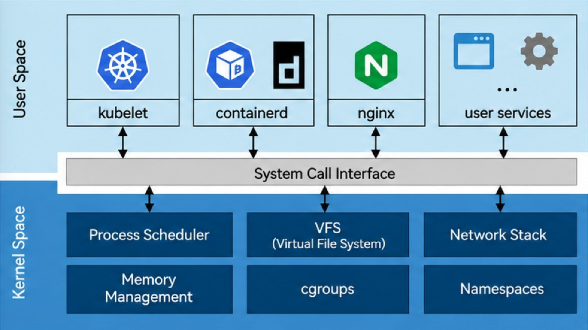

# [Ch-02] 단순 `kubectl` 그만 — 쿠버네티스 엔지니어가 리눅스 커널을 반드시 알아야 하는 이유

> 영상: [플레이 빌더 — Ch-02 (YouTube)](https://www.youtube.com/watch?v=XsgYsvgA0Ow)  
> 실습 저장소: [play-builder/kubeadm-cluster](https://github.com/play-builder/kubeadm-cluster)

Ch-01에서 다룬 것처럼 **쿠버네티스는 지시자**, **리눅스 커널은 집행자**다. OOMKilled·CPU Throttling 같은 현상은 모두 커널이 내린 결정의 결과다. 많은 엔지니어가 커널을 “알아서 도는 블랙박스”로만 두지만, K8s를 깊게 다루려면 블랙박스 안의 **자원 관리·명령 수행 구조**를 짚고 넘어가야 장애 로그 너머의 사실을 볼 수 있다.

**이번 챕터에서 던지는 다섯 가지 질문**은 다음과 같다.

1. 커널은 메모리를 **왜**, **어떻게** 나누는가?  
2. 유저 스페이스의 프로그램이 커널에 **어떻게** 요청하는가?  
3. 쿠버네티스 컴포넌트는 커널 위에서 **어떻게** 동작하는가?  
4. 컨테이너가 돌려면 커널이 **무엇을** 준비해야 하는가?  
5. `/proc`은 디스크에 없는데 **왜** 파일처럼 보이는가?

이 질문들에 답하면 `kube-proxy`, **kubelet**, **containerd** 같은 구성요소를 구조적으로 이해하기 시작할 수 있다.

:::tip
- **kubelet**: 각 노드에서 파드·컨테이너 생명주기를 관리하고 API 서버와 통신하는 에이전트.
- **kube-proxy**: 서비스 IP로 들어오는 트래픽을 엔드포인트(파드 IP)로 넘기기 위해 **iptables/nftables/IPVS** 등으로 규칙을 맞추는 데몬(구현은 모드에 따라 다름).
- **containerd**: 컨테이너 실행을 담당하는 **CRI** 런타임(이미지 pull, 컨테이너 생성/삭제).
:::

---

## 1. 왜 리눅스를 먼저 배우는가

쿠버네티스는 **리눅스에 의존**한다. 모든 컴포넌트는 결국 리눅스 위에서 돈다.

- **kubelet**은 리눅스의 **시스템 데몬**에 가깝다.  
- **파드**는 **네임스페이스**와 **cgroup**으로 만든 격리 공간이다.  
- **서비스 라우팅**은 커널의 **iptables**나 **eBPF** 등으로 구현된다.

밑바탕 리눅스를 모르면 K8s는 **명령어를 치는 도구** 수준에 머물기 쉽고, 장애 시 구조를 해석하기 어렵다.

:::tip
- **데몬(daemon)**: 부팅 후 백그라운드에서 계속 돌아가는 서비스 프로세스(`systemd`가 자주 관리).
- **네임스페이스(Namespace)**: PID·네트워크·마운트 등 “보이는 세계”를 프로세스마다 나누는 커널 격리 기능.
- **cgroup(control group)**: CPU·메모리 등 사용량을 그룹별로 제한·측정하는 커널 기능.
- **iptables**: 패킷 필터링·NAT(주소 변환) 규칙을 커널 **Netfilter**에 걸 때 쓰는 전통적인 사용자 공간 도구/규칙 체계.
- **eBPF**: 커널에 안전하게 프로그램을 붙여 네트워크·관측 등을 고성능으로 처리하는 기술.
:::

---

## 2. 유저 스페이스 vs 커널 스페이스

리눅스는 메모리를 크게 둘로 나눈다.

- **유저 스페이스(User space)**: kubelet, containerd, nginx, 여러분이 만든 앱 등이 동작.  
- **커널 스페이스(Kernel space)**: 스케줄러, 메모리 관리, 파일 시스템, 네트워크 스택, **cgroup·네임스페이스** 등 OS 핵심.

둘 사이의 경계가 **시스템 콜 인터페이스**다. 유저 스페이스는 **시스템 콜**을 통해서만 커널로 요청이 넘어간다.

**왜 나누나?**

1. **보안**: 유저 프로그램이 하드웨어를 직접 만지면 다른 프로세스 메모리를 읽거나 디스크를 망가뜨리기 쉽다. 커널이 **허용된 작업만** 대행한다.  
2. **안정성**: nginx가 죽으면 그 프로세스만 죽는다. **커널이 패닉**하면 **전체 시스템 다운**이다. 프로덕션에서 노드가 **NotReady**로 빠지고 파드가 다른 노드로 **재스케줄**되는 맥락과 연결된다.

**kubelet이 파드를 “직접” 만드는 것이 아니다.** kubelet이 “만들어 달라”고 하면, **시스템 콜**을 통해 커널이 **네임스페이스·cgroup**을 설정한다. **containerd**도 마찬가지로, 최종적으로 **runc**가 시스템 콜로 커널에 **프로세스 생성·격리**를 요청한다. 실습에서는 **strace**로 컨테이너 생성 시점에 **clone**, **unshare** 같은 시스템 콜이 찍히는 것을 볼 수 있다고 한다.

**정리:** K8s 컴포넌트는 **유저 스페이스**에서 돌고, 실제 집행은 **커널 스페이스**에서 이뤄진다.

그 경계 너머에서 컨테이너 격리가 어떻게 보이는지, 한 파드 안을 예로 들면 다음과 같다. 같은 파드 안의 컨테이너는 모든 네임스페이스를 공유하는 것이 아니다. 흔히 **Network·IPC·UTS**는 파드 단위로 **공유**되어 같은 IP·호스트 이름처럼 보이게 하고, **PID**와 **Mount**는 컨테이너마다 **격리**되어 서로의 프로세스 목록이나 파일 트리가 섞이지 않는다. 아래 **“2-3-2”** 개념도는 그 관계를 nginx와 사이드카 예로 나타낸 것이며, 공유 네임스페이스를 잡아 두는 **pause(인프라) 컨테이너**가 함께 그려져 있다.

:::tip
- **유저 스페이스 / 커널 스페이스**: 권한·주소 공간이 나뉘어, 애플리케이션은 커널이 허용한 경로(시스템 콜)로만 커널 기능에 접근한다.
- **시스템 콜(System call)**: 유저 프로그램이 커널에게 “파일 열어 줘”, “소켓으로 보내 줘”처럼 요청하는 **공식 API**. 유일한 경계 통로에 가깝다.
- **커널 패닉(Kernel panic)**: 커널이 복구 불가능한 오류를 만나 멈추거나 재부팅되는 심각한 실패.
- **runc**: OCI 규격에 맞춰 컨테이너 프로세스를 만들고 cgroup·namespace를 적용하는 저수준 런타임.
- **strace**: 프로세스가 호출하는 시스템 콜을 추적하는 디버깅 도구.
- **clone / unshare**: 새 네임스페이스·프로세스를 만들 때 쓰이는 대표적인 시스템 콜 계열.
:::

---

## 3. 시스템 콜이란 무엇인가

**정의:** 유저 스페이스 프로그램이 커널에게 “이거 해 줘”라고 요청하는 **공식 인터페이스**다.

예시:

- 파일 읽기: **open**, 읽기 **read**, 쓰기 **write**  
- 네트워크: **sendto** 등  
- 새 프로세스: **clone**  
- 네임스페이스 분리: **unshare** (컨테이너에서 중요)

최신 커널 기준 시스템 콜은 대략 **460개** 수준이라고 한다. 전부 외울 필요는 없지만, **보안 아키텍트** 관점에서는 “많은 시스템 콜 = 공격 표면”을 염두에 두어야 한다.

만약 파드 안 컨테이너가 **위험한 시스템 콜까지 마음대로** 호출할 수 있다면, nginx 취약점 하나로 **파드 하나**를 넘어 **노드 전체 장악**으로 이어질 수 있다. 이를 <strong>컨테이너 이스케이프(container escape)</strong>라고 한다. 그래서 **seccomp** 같은 **보안 프로파일** 적용이 중요하다고 하며, CKS·보안 챕터에서 더 다룬다고 한다.

:::tip
- **파일 디스크립터(File descriptor)**: 열린 파일·소켓 등에 붙는 정수 핸들(0=stdin, 1=stdout 등).
- **seccomp(Secure Computing Mode)**: 프로세스가 호출할 수 있는 **시스템 콜을 화이트리스트/블랙리스트로 제한**하는 커널 보안 기능.
- **컨테이너 이스케이프**: 컨테이너 격리를 뚫고 호스트나 다른 워크로드에 영향을 주는 침해 시나리오.
- **CKS(Certified Kubernetes Security Specialist)**: 쿠버네티스 보안 자격증.
:::

---

## 4. 코어 커널 vs 커널 모듈

커널은 <strong>부팅에 필수인 코어(내장)</strong>와, 필요할 때 붙이는 <strong>커널 모듈(동적 로드)</strong>로 나뉜다.

- **코어**: 컴파일된 커널 바이너리에 완전히 내장. **modprobe로 로드하는 모듈이 아니다.** 코어 구성요소 하나라도 빠지면 부팅이 안 될 수 있다.  
- **모듈**: `modprobe`로 올리고 `lsmod`로 확인. 쓸 때만 메모리에 올라온다.

### 4.1 프로세스 스케줄러

CPU가 적고 프로세스가 많을 때, **누구에게 CPU 시간을 줄지** 정하는 것이 스케줄러다. kubelet·containerd·nginx 등 “동시에 도는 것처럼” 보이는 이유다.

K8s YAML의 **CPU request**(예: 500m)는 “코어 0.5분량을 **보장**해 달라”는 의미에 가깝고, 값이 커널 **cgroup의 `cpu.weight` 등 가중치**로 전달되어, CPU가 경쟁할 때 **비율대로** 나눠 받게 된다고 설명한다. 여유가 있으면 request보다 더 쓸 수도 있다.

**CPU limit**(예: 1000m)는 “아무리 남아도 **1코어 이상은 못 쓴다**”는 **절대 상한**이고, **cgroup의 `cpu.max`** 등으로 전달되어 초과 시 <strong>일시 정지(스로틀)</strong>된다 — Ch-01의 CPU Throttling과 연결된다.

즉 YAML의 request/limit은 단순 숫자가 아니라 **스케줄러·cgroup에게 내리는 작업 지시**다.

:::tip
- **프로세스 스케줄러**: 실행 큐에서 다음에 CPU를 줄 프로세스를 고르는 커널 하위시스템.
- **밀리코어(m)**: K8s에서 1 CPU = 1000m처럼 표현하는 단위.
- **cpu.weight / cpu.max**: cgroup v2에서 CPU 상대 우선순위·상한을 표현하는 대표 인터페이스(배포판·커널 설정에 따라 세부 키 이름은 v1/v2에서 다를 수 있음).
:::

### 4.2 메모리 관리

커널은 RAM을 나눠 주고 회수한다. 시스템 전체가 메모리 부족이면 **OOM Killer**가 동작해 프로세스를 강제 종료한다.

파드 YAML의 **memory limit**(예: 512Mi)는 cgroup으로 전달되어 **`memory.max`** 등에 기록되고, 한도를 넘는 순간 커널이 해당 프로세스를 종료한다. `kubectl describe`에서 **OOMKilled**로 보이는 것은 **커널이 집행한 결과를 K8s가 표시**한 것이다.

**MiB vs MB:** 메가바이트(10진)와 메비바이트(2진)는 약 **4.8%** 차이가 난다. 리소스 관리에서는 이 차이가 누적되므로 K8s는 **이진 단위(Mi, Gi)** 표기를 쓴다고 강조한다.

:::tip
- **OOM Killer**: 메모리 압박 시 어떤 프로세스를 희생할지 고르고 강제 종료하는 커널 메커니즘.
- **MiB/GiB**: 1024 기반(이진) 용량 단위. 마케팅용 GB(1000 기반)와 혼동하지 않도록 주의.
:::

### 4.3 VFS(가상 파일 시스템)

ext4, **overlay**(컨테이너 이미지 레이어), **proc**(커널 상태) 등 성격이 다른 파일 시스템이 공존한다. 셸이나 프로그램은 “디스크인지 메모리인지” 신경 쓰지 않고 <strong>같은 시스템 콜(open/read/write)</strong>만내면 된다.

**VFS**가 경로를 보고 “어느 실제 파일 시스템으로 보낼지” 중재한다. “**리눅스는 모든 것이 파일이다**”는 말이 VFS 덕분에 성립한다고 설명한다.

:::tip
- **VFS(Virtual File System)**: 서로 다른 파일 시스템 구현 위에, 애플리케이션에게 일관된 파일 API를 제공하는 커널 추상층.
- **overlay(Overlay FS)**: 여러 디렉터리(레이어)를 겹쳐 하나의 트리처럼 보이게 하는 결합 파일 시스템.
:::

### 4.4 네트워크 스택

K8s만을 위한 완전히 새로운 네트워크 프로토콜은 없다고 한다. **패킷은 커널 TCP/IP 스택을 그대로 탄다.** 앱이 소켓을 열고 → TCP/UDP → IP → NIC로 나간다.

<strong>서비스(Service)</strong>는 흐름 중간에 **kube-proxy**가 심어 둔 <strong>iptables 규칙(Netfilter)</strong>으로 목적지 IP가 바뀌는(DNAT 등) 식으로 동작한다고 개략 설명하고, 상세는 네트워크 챕터로 미룬다.

:::tip
- **Netfilter**: 커널 안에서 패킷을 가로채 필터링·NAT·라우팅 훅을 제공하는 프레임워크.
- **DNAT(Destination NAT)**: 목적지 IP·포트를 다른 값으로 바꿔 주는 NAT의 한 종류. ClusterIP를 파드 IP로 바꿀 때 자주 등장.
:::

### 4.5 IPC(프로세스 간 통신)

같은 물리 서버 안 프로세스가 데이터를 주고받을 때 매번 무거운 네트워크 스택을 태우는 것은 비효율적이라, 커널은 **공유 메모리**, **세마포어** 등 빠른 통로를 제공한다. 이를 통틀어 **IPC**라고 한다.

**같은 파드** 안 컨테이너들은 **IPC 네임스페이스를 공유**한다 — 네트워크 없이도 커널 수준에서 데이터를 주고받을 수 있다. **파드가 다르면** IPC 공간은 **완전히 분리**된다. “파드”라는 논리 단위가 커널 아래에서 어떻게 정의·보호되는지 직관적으로 보인다고 한다.

:::tip
- **IPC(Inter-Process Communication)**: 파이프, 공유 메모리, 소켓 등 프로세스 간 데이터 교환 방식.
- **세마포어(Semaphore)**: 공유 자원 접근을 조율하는 동기화 기본 도구 중 하나.
:::

### 4.6 보안: LSM vs seccomp

- **LSM(Linux Security Module)**: **SELinux**, **AppArmor** 등 — “이 프로세스가 저 파일/리소스에 접근해도 되는가” 같은 **객체 접근 통제**에 가깝다.  
- **seccomp**: **시스템 콜 단위**로 행동을 막는 축.

둘은 **다른 레벨의 방어망**이다. 파드 **securityContext**에서 비루트 실행, 권한 상승 방지, seccomp 프로파일 등을 걸 수 있으며 CKS에서도 중요하다고 한다.

:::tip
- **SELinux / AppArmor**: 강제 접근 통제(MAC) 계열로, 프로세스·파일에 라벨/프로파일을 붙여 허용 동작을 제한.
- **securityContext**: 파드/컨테이너 스펙에서 실행 유저, capabilities, seccomp, AppArmor 프로파일 등을 선언하는 필드.
:::

### 4.7 블록 레이어·디바이스 모델

**블록 레이어**는 디스크 I/O 요청을 정리·스케줄링하는 계층이다. **CSI(Container Storage Interface) 드라이버**가 이 경로를 통해 **PV/PersistentVolume**을 파드에 마운트한다고 개략 설명한다.

**디바이스 모델**은 GPU 같은 장치를 소프트웨어적으로 관리하는 체계다. **`/sys`** 등 가상 파일 시스템으로 장치 정보를 노출하고, **dynamic resource allocation** 등으로 특수 장치를 파드에 할당한다고 언급한다.

:::tip
- **CSI**: 스토리지 벤더가 쿠버네티스에 볼륨 플러그인을 붙이기 위한 표준 인터페이스.
- **PV(Persistent Volume)**: 클러스터 차원의 스토리지 리소스(파드와 독립된 수명).
- **`/sys`**: 커널·장치·버스 정보를 파일 형태로 노출하는 가상 파일시스템(sysfs).
:::

### 4.8 네임스페이스와 cgroup(다시 한 줄)

**컨테이너 = 네임스페이스로 격리된 리눅스 프로세스**다.

- **네임스페이스**: “**무엇을 볼 수 있는가**” 격리. 컨테이너 안 PID 1이 호스트에서는 수천 번대 PID로 보인다. 네트워크·마운트·호스트명도 분리. **커널 소스에 내장**되어 `lsmod`로는 안 보인다.  
- **cgroup**: “**얼마나 쓸 수 있는가**” 제한. CPU request/limit, memory limit은 여기로 전달된다. **kubelet → containerd → runc → cgroup 설정 → 커널 집행** 흐름.
- **cgroup v2**: cgroup의 통합된 두 번째 세대. 단일 계층 구조와 일관된 인터페이스로 운영이 단순해진다.

강의에서는 **쿠버네티스가 cgroup v2를 필수에 가깝게 쓰는 방향**을 언급한다(녹취상 버전 번호는 릴리스 노트로 확인하는 것이 안전하다).

---

## 5. 커널 모듈: `overlay`와 `br_netfilter`

### 5.1 overlay

컨테이너 이미지는 **여러 레이어**가 쌓인 구조다. **overlay** 모듈이 레이어를 합쳐 **하나의 파일 시스템**처럼 보이게 한다. **containerd**가 컨테이너 시작 시 overlay를 사용한다. 모듈이 없으면 레이어 합성이 안 되어 **컨테이너 생성 실패**로 이어진다. 노드 준비 시 <strong><code>modprobe overlay</code></strong>를 먼저 하는 이유다.

### 5.2 br_netfilter와 서비스 IP(택배 비유)

**서비스 ClusterIP**(예: 10.96.0.10)는 **실제 NIC에 바인딩되지 않은 가상 IP**다. `ip addr`로 찾아도 없다. **iptables 규칙 세계에만 존재**한다고 설명한다.

패킷(택배)이 **L2 브릿지**를 지나갈 때:

- **br_netfilter 비활성**: 패킷이 브릿지에서 **그냥 직진**하면, 가상 IP는 물리적으로 없어 **목적지 불가·통신 실패**.  
- **br_netfilter 활성**: 브릿지를 통과하는 패킷이 **한 단계 위로** 올라가 **L3 iptables**를 만난다. **kube-proxy**가 API 서버를 보고 서비스→엔드포인트 정보에 맞춰 **iptables 규칙을 미리 작성**한다. **DNAT**으로 가상 IP가 **실제 파드 IP**로 바뀌고, 라우팅 후 같은 노드면 다시 L2로, 다른 노드면 **VXLAN 터널** 등으로 넘어간다고 개략만 짚는다.

**br_netfilter는 “서비스 IP인지”를 구분하지 않고**, L2 브릿지를 통과하는 **모든 패킷**을 검사한다고 강조한다.

:::tip
- **L2 / L3**: OSI 계층으로, L2는 이더넷·MAC 중심, L3는 IP·라우팅 중심.
- **브릿지(bridge)**: 여러 인터페이스를 한 스위치처럼 묶는 가상 L2 장치. 파드 네트워크에서 자주 등장.
- **ClusterIP**: 서비스에 할당되는 가상 클러스터 내부 IP.
- **VXLAN**: L3 위에 L2를 얹어 원격 노드 간 터널링하는 오버레이 네트워크 기술 중 하나.
:::

---

## 6. `/proc` 가상 파일 시스템

`/proc`은 **RAM에 올라간 가상 파일 시스템**이다. 디스크의 “진짜 파일”이 아니다. `du`로 보면 **0바이트**로 나올 수 있다.

일반 파일은 VFS → ext4 등 → 블록 레이어 → 디스크로 내려가지만, **`/proc`은 디스크로 내려가지 않는다.** `read` 시스템 콜이 오면 커널이 **RAM의 내부 구조를 읽어** 텍스트로 **실시간 렌더링**해 준다.

`/proc/kcore`처럼 **비정상적으로 큰 크기**로 보이는 항목도, 실제 디스크 점유가 아니라 **가상 주소 공간을 파일 형태로 매핑**한 것이라고 설명한다.

:::tip
- **`/proc`**: 실행 중인 프로세스·CPU·메모리·커널 파라미터 등을 파일처럼 노출하는 인터페이스.
- **렌더링**: 디스크에 저장된 고정 본문이 아니라, 읽는 순간 커널이 내용을 만들어 돌려준다는 뜻.
:::

---

## 7. 쿠버네티스에 필요한 커널 파라미터(요지)

노드가 정상이려면 **`/proc/sys/net/...` 쪽 IPv4·iptables·ip6tables 관련 값**이 맞아야 한다고 한다. 검증 전에 **커널 모듈**이 먼저 로드되어 있어야 한다.

1. <strong><code>lsmod</code></strong>로 **overlay**, **br_netfilter**가 보이는지 확인.  
   - overlay 없음 → 이미지 레이어 합성 불가 → 컨테이너 생성 에러.  
   - br_netfilter 없음 → `/proc/sys/net/bridge/...` 파일이 생기지 않아 **bridge-nf-call-iptables** 등을 셋팅할 수 없을 수 있다.

2. **`net.ipv4.ip_forward`**: 노드가 **자기 IP가 아닌 목적지**로 가는 패킷을 **포워딩**할지(1=허용). **0이면** 파드→다른 노드 파드 트래픽이 **드롭**될 수 있다. CNI가 라우팅 규칙을 깔아 두어도, 포워딩이 꺼져 있으면 중계가 안 된다는 설명이다.

3. **`net.bridge.bridge-nf-call-iptables`**: 기본적으로 **브릿지를 지나는 패킷은 iptables를 거치지 않을 수 있는데**, 이 값이 **1**이면 브릿지 트래픽이 **강제로 iptables를 경유**한다. **0**이면 **DNAT 규칙이 적용되지 않아** ClusterIP가 그대로 남아 **가상 IP를 라우팅으로 찾지 못해 실패**할 수 있다 — 위의 “두 갈래 운명” 다이어그램과 연결.

4. **`net.bridge.bridge-nf-call-ip6tables`**: IPv6 트래픽에 대한 동일 원리.

강의에서는 **`cat /proc/sys/net/ipv4/ip_forward`**, **`/proc/sys/net/bridge/bridge-nf-call-iptables`** 등으로 **1**인지 확인하는 실습 흐름이 나온다.

:::tip
- **ip_forward**: 리눅스를 **라우터처럼** 패킷을 넘겨 줄지 여부를 제어하는 커널 스위치.
- **bridge-nf-call-iptables**: 브릿지 경로의 패킷도 Netfilter/iptables 처리 파이프라인에 넣을지 결정.
:::

---

## 8. iptables의 역할(이 챕터 범위에서)

iptables는 패킷을 “대신 배달”하지 않고, **규칙에 따라 주소·경로를 바꾸는 표지판/교차로**에 가깝다고 비유한다. DNAT으로 목적지를 실제 파드 IP로 바꾼 뒤, **라우팅**이 실제 전달을 이어간다.

---

## 9. 터미널 실습에서 다룬 것들(요약)

- **`cat /proc/cpuinfo`**: `processor` 개수, `cpu cores`, `siblings`(하이퍼스레딩으로 논리 CPU가 늘어난 것), `flags`(CPU가 지원하는 기능·하이퍼바이저 게스트 여부 등).  
- **메모리**: `dmidecode`로 물리 RAM, `/proc/meminfo`의 **MemTotal**은 “손님에게 빌려 줄 수 있는 양”에 가깝고 물리와 약간 차이 — 커널이 **자기 생존용**으로 일부를 예약한다는 **호텔 객실 비유**.  
- **Swappiness**: K8s는 예측 가능한 메모리 동작을 위해 **스왑을 끄는** 구성이 일반적이라고 언급. **MemAvailable**은 캐시를 돌려받을 수 있는 여유까지 포함; kubelet의 메모리 압박 판단과 연결된다고 한다.  
- **`strace cat /proc/cpuinfo`**: **open** → fd 할당 → **read**로 커널이 RAM에서 텍스트 생성 → **write**로 터미널 출력 → **read** 반환 0은 EOF.  
- **`lsmod` vs cgroup**: cgroup은 `lsmod`에 안 나오지만 **`mount | grep cgroup`** 등으로 cgroup2 마운트 확인.  
- **`modinfo overlay`**: 모듈 파일 경로·메타데이터. <strong><code>modprobe</code></strong>는 이미 로드된 모듈에 다시 해도 안전한 **멱등성**. overlay **참조 카운트**가 0보다 크면 컨테이너가 마운트를 쓰는 중이라 강제 언로드가 어렵다는 식의 설명.  
- **노드 필수 체크 5가지**(강의 후반 정리): `/etc/modules-load.d` 등에 overlay·br_netfilter, `/proc/sys/net/ipv4/ip_forward`, bridge-nf-call-iptables/ip6tables = 1. 하나라도 빠지면 파드 생성·통신에 치명적일 수 있다.

실습 환경은 끝나면 **`terraform destroy -auto-approve`** 등으로 정리해 **AWS 과금**을 막는다.

:::tip
- **하이퍼스레딩(Hyper-Threading)**: 물리 코어 하나에 논리 CPU 두 개를 보이게 해 일부 워로드에서 처리량을 높이는 기술.
- **멱등성(Idempotency)**: 같은 작업을 여러 번 해도 결과가 한 번 한 것과 같게 유지되는 성질.
- **swappiness**: 스왑(디스크 기반 가상 메모리) 사용 성향을 조절하는 커널 파라미터.
- **MemAvailable**: “지금 당장 + 캐시 반환으로” 애플리케이션이 쓸 수 있을 법한 메모리 추정치.
:::

---

## 10. 마무리

쿠버네티스는 **리눅스 시스템 콜·cgroup·네임스페이스·네트워크 스택·VFS·모듈** 위에 얹힌다. **K8s는 지시자, 커널은 집행자**라는 Ch-01의 결론을, 이번 시간에는 **아키텍처와 `/proc`·파라미터·strace**로 한 번 더 증명하는 구성이다. 이후 챕터에서 cgroup·네임스페이스·보안·네트워크를 더 깊게 파겠다는 예고로 이어진다.