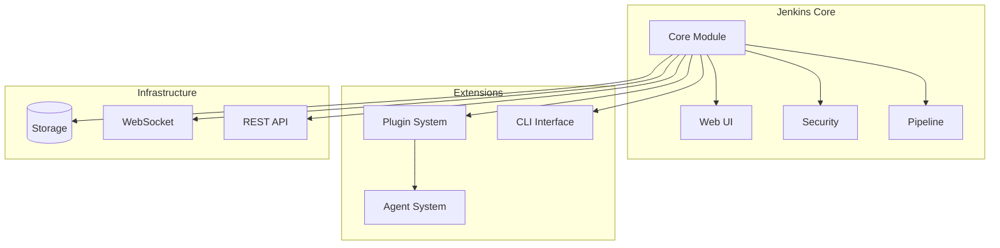

```mermaid
graph TB
    subgraph Jenkins Core
        Core[Core Module]
        WebUI[Web UI]
        Security[Security]
        Pipeline[Pipeline]
    end
    
    subgraph Extensions
        Plugin[Plugin System]
        Agent[Agent System]
        CLI[CLI Interface]
    end
    
    subgraph Infrastructure
        DB[(Storage)]
        WebSocket[WebSocket]
        REST[REST API]
    end
    
    Core --> WebUI
    Core --> Security
    Core --> Pipeline
    Core --> Plugin
    Plugin --> Agent
    Core --> CLI
    Core --> DB
    Core --> WebSocket
    Core --> REST
```
