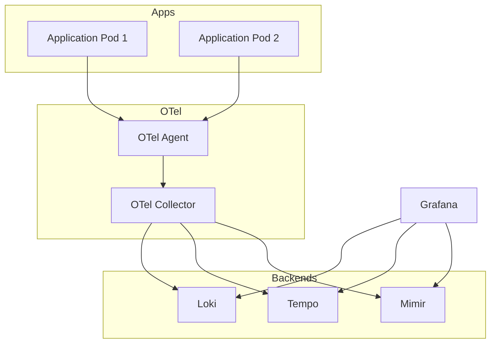

### 구성 요소 (요약)

| 영역 | 역할 |
|------|------|
| **Application / Pod** | 비즈니스 워크로드 |
| **OTel Agent** | 앱 프로세스에 붙는 에이전트(사이드카·라이브러리)로 텔레메트리 수집 |
| **OTel Collector** | Receiver → Processor → Exporter 파이프라인으로 로그·메트릭·트레이스 라우팅 |
| **Loki** | 로그 저장·조회 (LogQL) |
| **Tempo** | 분산 추적 저장 |
| **Mimir** | 메트릭 장기 저장·PromQL |
| **Grafana** | Loki / Tempo / Mimir 데이터소스로 대시보드·탐색 |
| **(선택) Istio** | 메시 트래픽·메트릭/로그와 연계 |
| **(선택) Grafana Alloy** | 수집·전달 파이프라인 단일 에이전트 |

OTLP gRPC/HTTP로 Collector에 보낸 뒤, 백엔드별 **Exporter**로 Loki·Tempo·Mimir에 나누어 넣는 형태를 많이 씁니다.

---

### 참고 다이어그램 (Mermaid)

---

### 더 읽을 거리

- [OpenTelemetry 문서](https://opentelemetry.io/docs/)